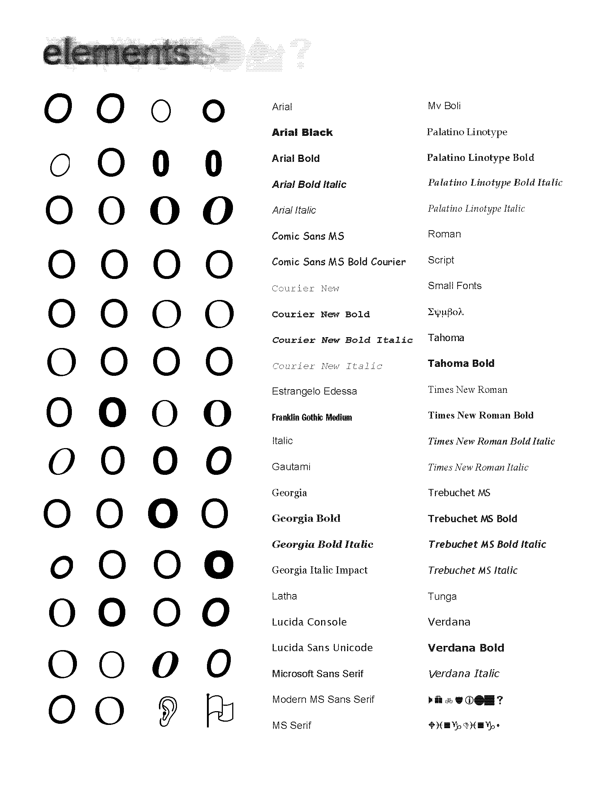
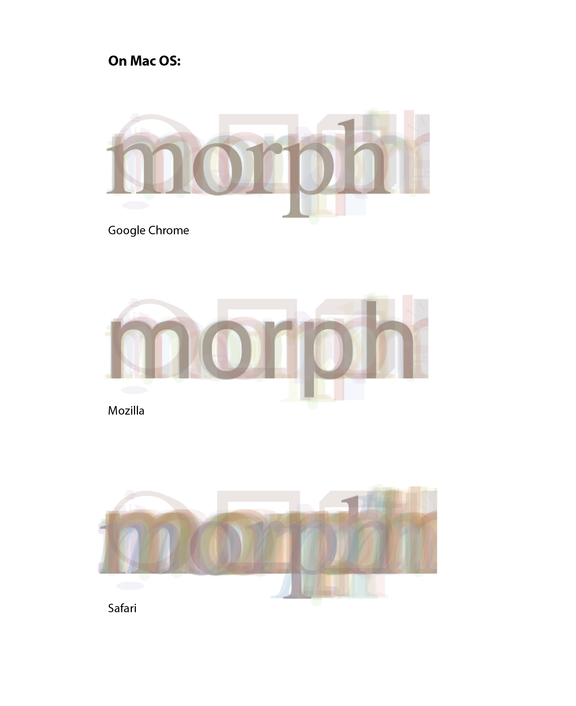
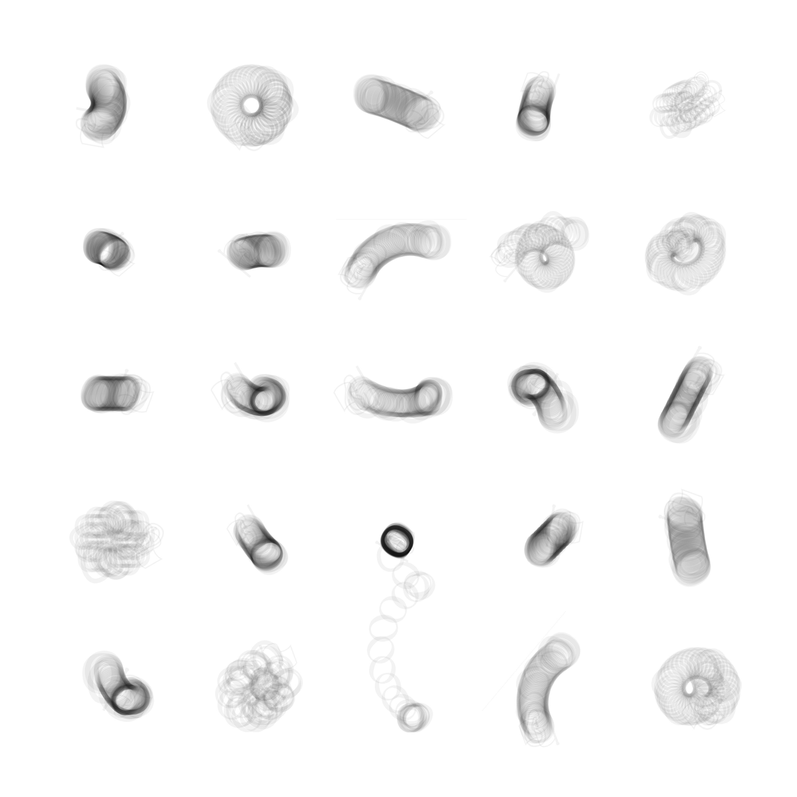
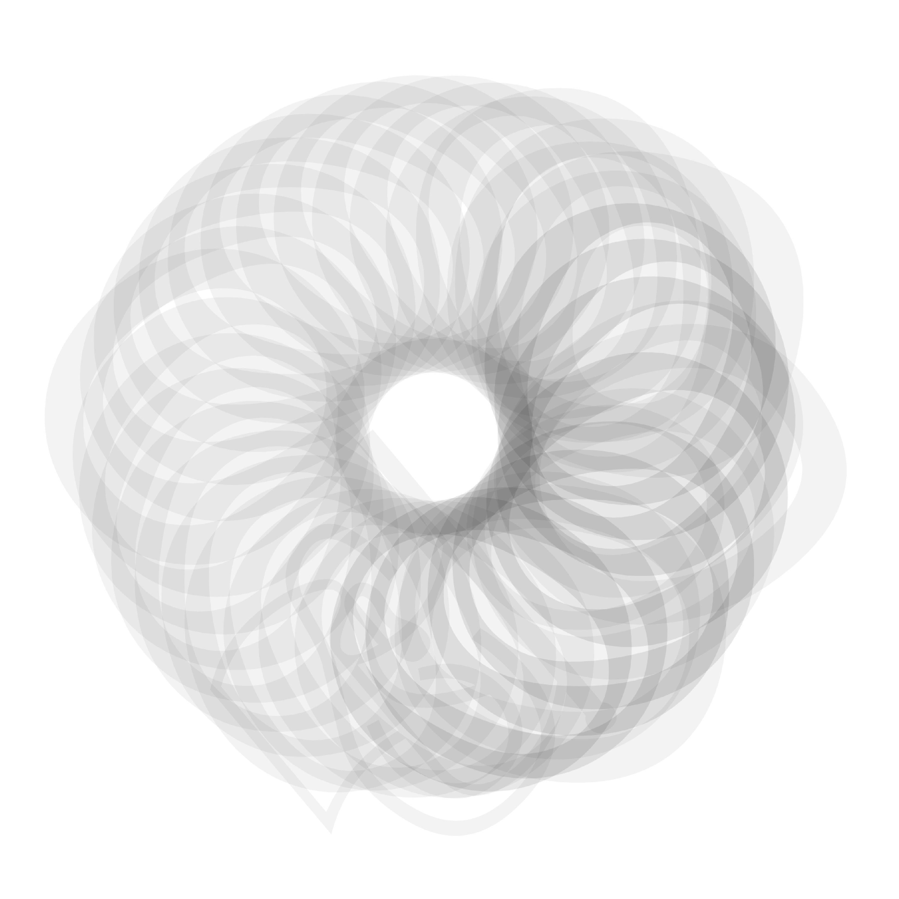
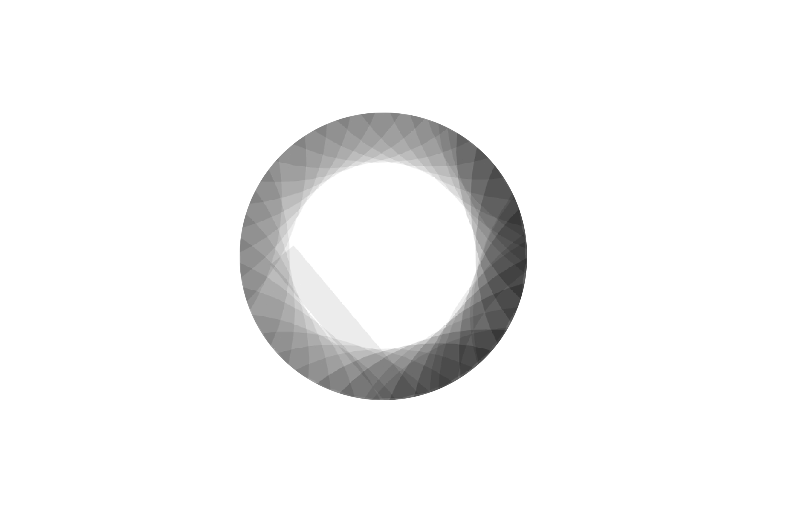
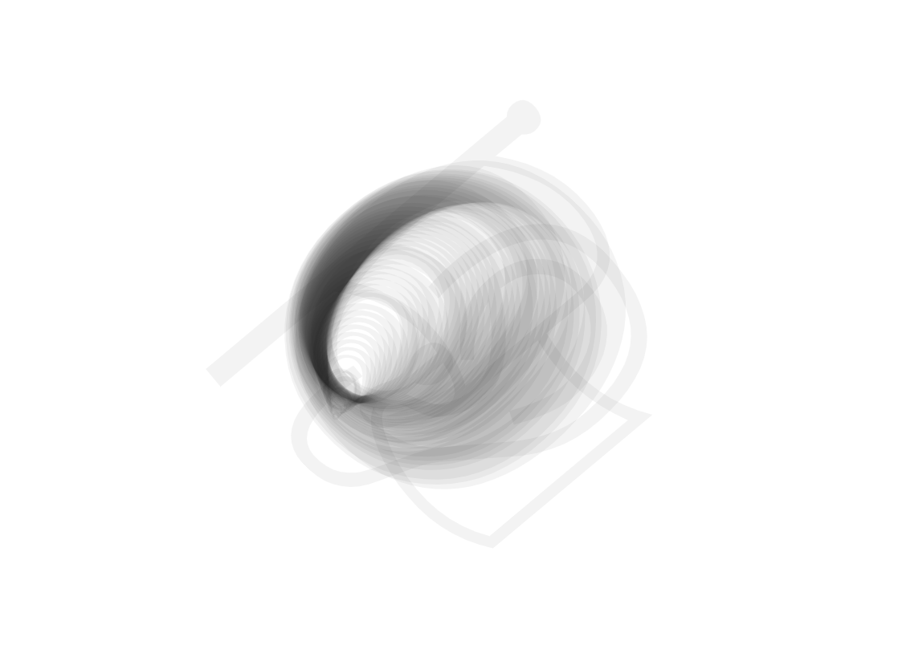
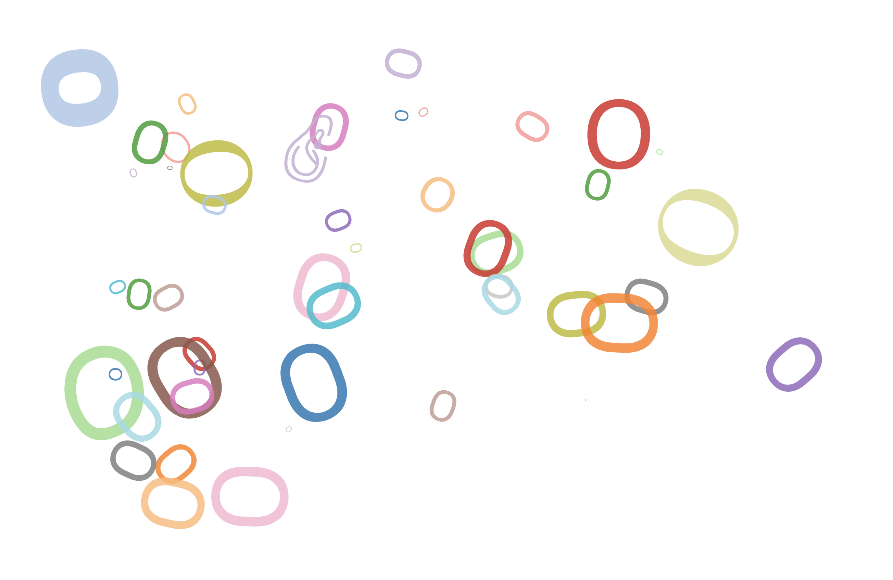
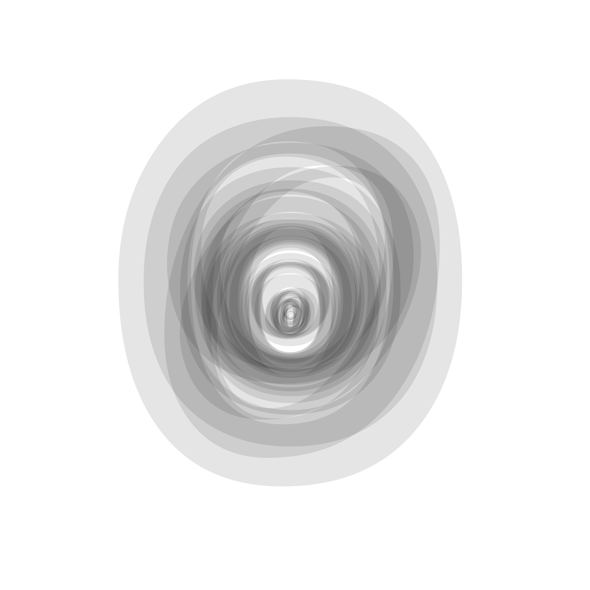
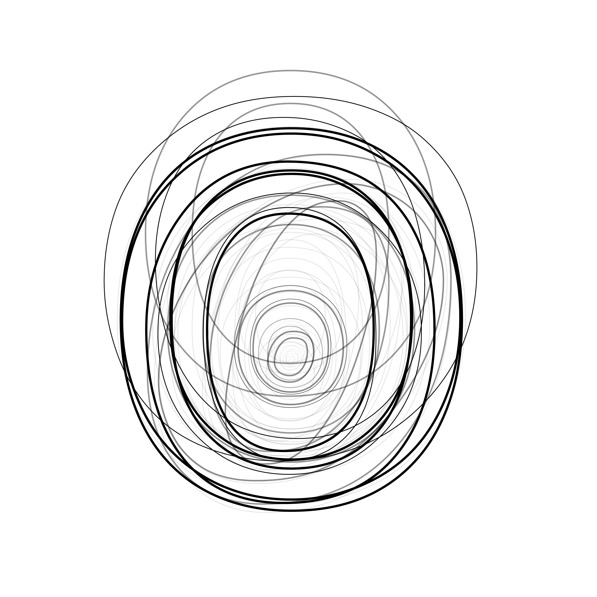

# Idea

## Creating a parametrized type.

Thinking about typography, one of the central aspects to type is readability. I had the idea that if one averaged all of a system's fonts together, you would get the most readable form of each letter by what each font had in common.

# Process

## I created a D3 javascript function that overlaid each system font on top of each other.

Play around with it here:
[https://garrettvercoe.com/average-font/](https://garrettvercoe.com/average-font/)

Each font is at a 5% opacity. You can see the fonts used below.

Some of the fonts are able to load in all browsers natively without import, so the font has a different appearance on each browser.

Another function of this is transforming each x, y, and angle positions of the font. I used this idea to play around with different types of movement. I focused on just creating different possibilities for the letter "o".

