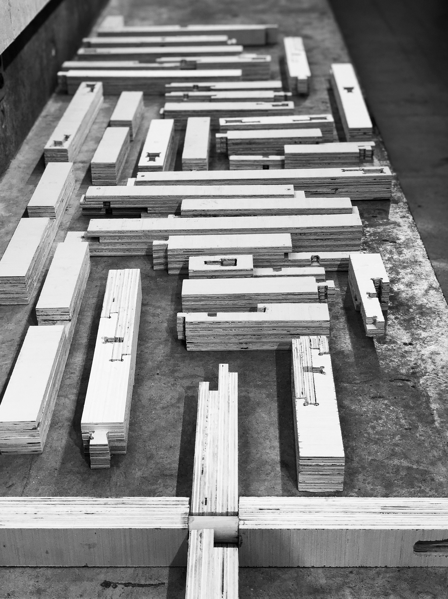
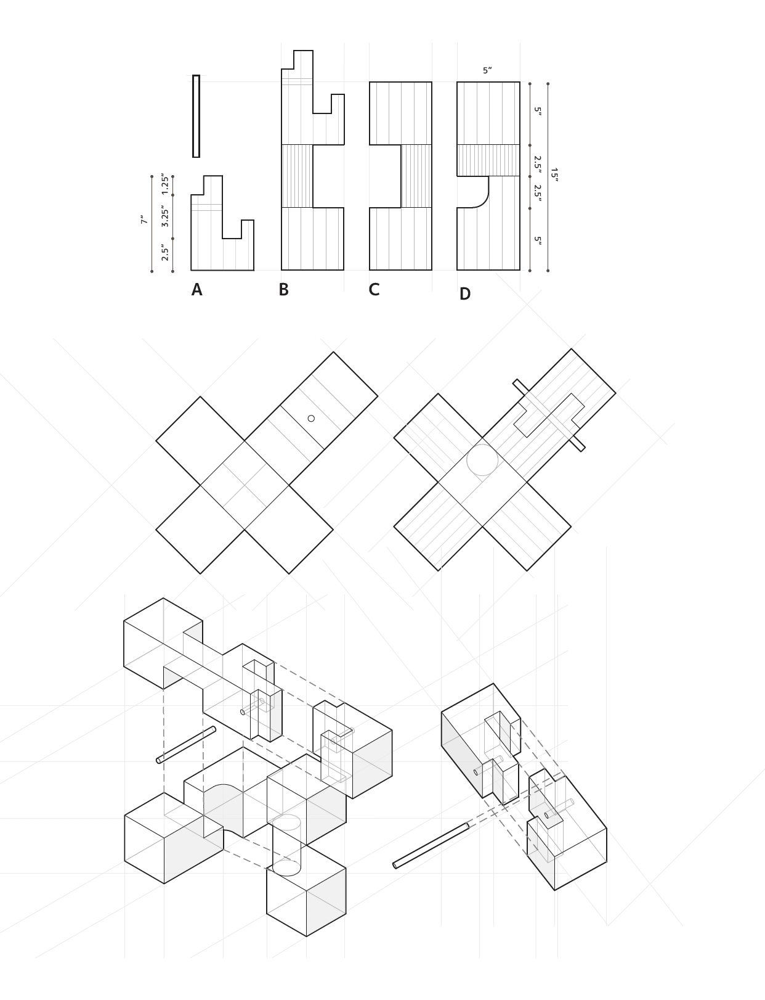
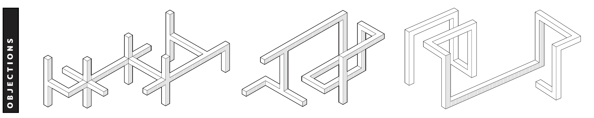
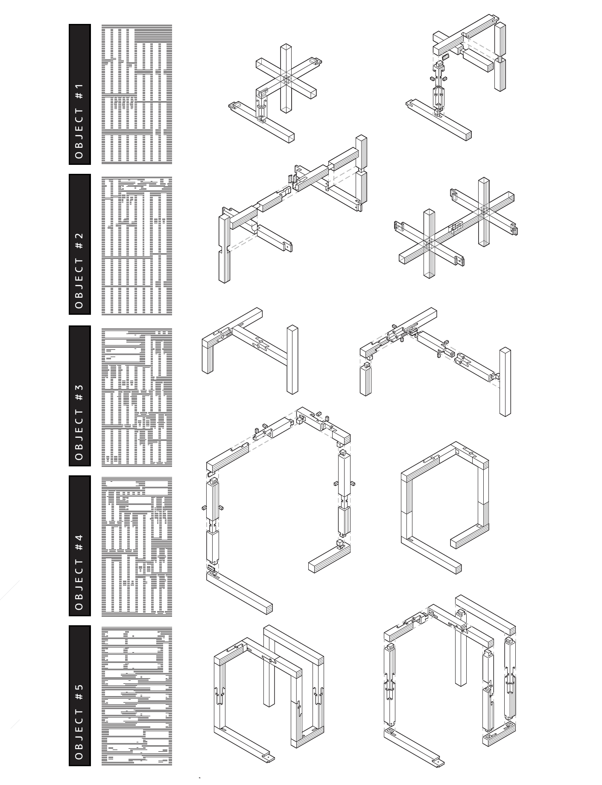
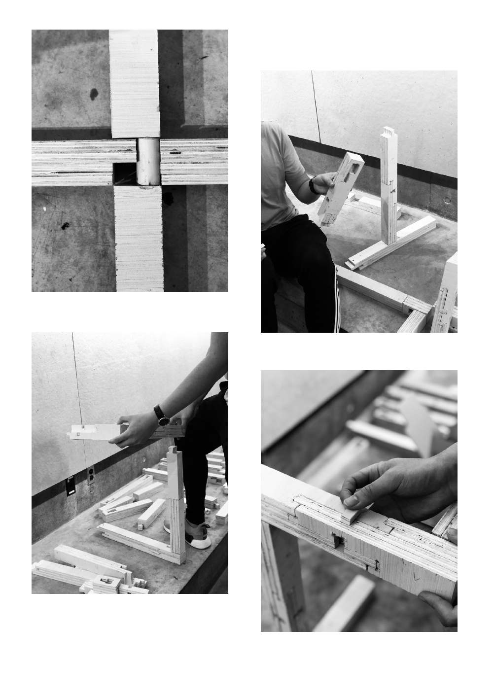
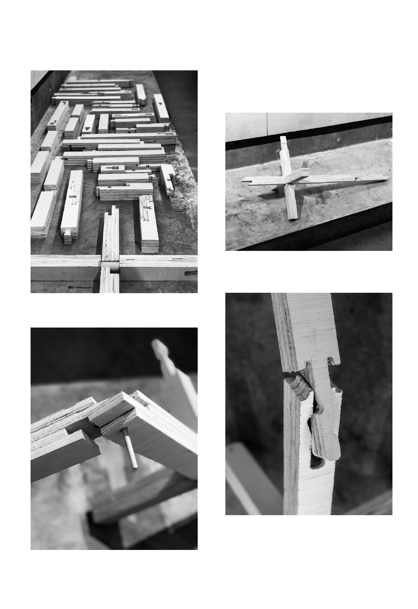

# Description

## Traditional Japanese joinery is beautiful, and requires great woodworking skill and time to master.

This project investigates how one might make material assembly easier, by looking at the scale of the detail. This manual joinery practice is reinterpreted to a digital medium by using CNC fabrication methods. This allows these joints to be created faster and at scale, offering new possibilities for their function.

# Process

I took traditional Japanese joints and transformed them for quick and efficient CNC fabrication, which was refined through an iterative process. I began with 3d-printing Japanese models and transforming them, and then doing various lasercut models. For the final CNC cuts, we laminated 1/4" pieces and created 5 different assemblies.

# Outcome

Coming together as a three person group, our final project, JointSpace, creates a series of modular joint constructions that can be aggregated at different levels of scale to create a function dictated by the user. Inspired by Sol Lewitt’s prouns, these modular joints are art at an individual level, and turn functional when combined together.

# Initial Work

## I began by translating a three dimensional Chidori joint to work on a CNC router.

# Aggregation

## Moving to larger scale aggregations, I teamed up with two others to find ways in which we could modularize our pieces.

We had 6 joints to work with, and created template functions for each type (for example I had one splice joint that always served as a connector between other joint groups). This creates a myriad of possible combinations and aggregations. Since each joint has the end of another joint, they can aggregate to as many pieces as needed.

# Strategy

## From each joint combination, we created five bigger "objects" that can be further aggregated to create space.

Our main idea for these joints was to have them be sturdy, but thin and long enough that their connections started to define boundaries of space. These five objects each use a different permutation of our joints, and have joint connectors to continually aggregate. On the left of the below pictures, you can see the CNC plywood cut sheets and each object beside it.

# Assembly

## Using this schema for construction, we CNC'ed the objects and began assembly.

Below you can see the assembly of the joints and objects being put together, and one possible aggregation scheme that we used for presentations.

# Thinking forward

## This aggregation serves as a proof of concept for larger scale aggregations and schema to be created in the future.

You can see one of the possible permutations below.

