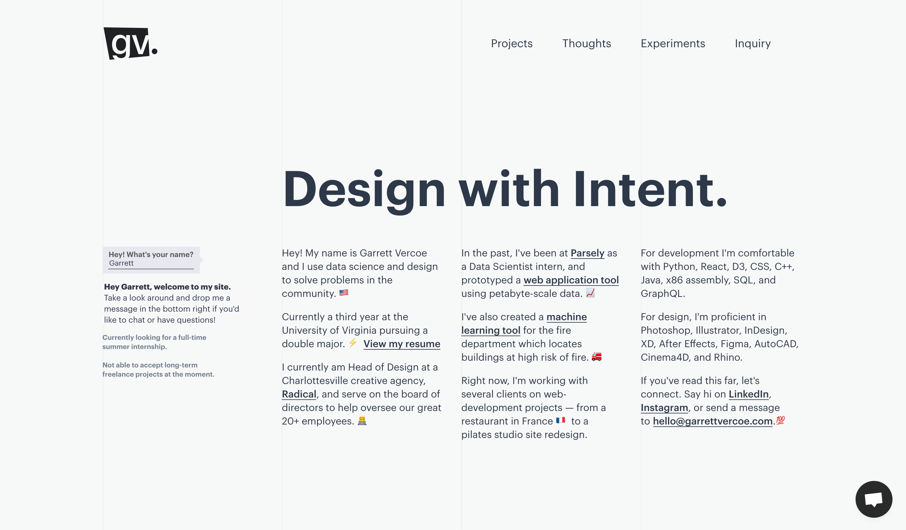
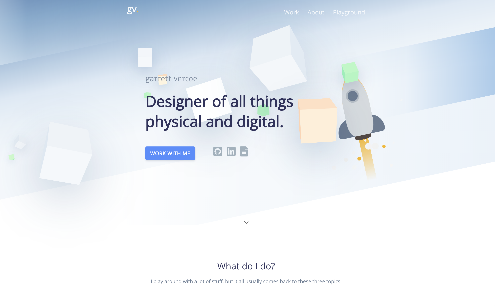
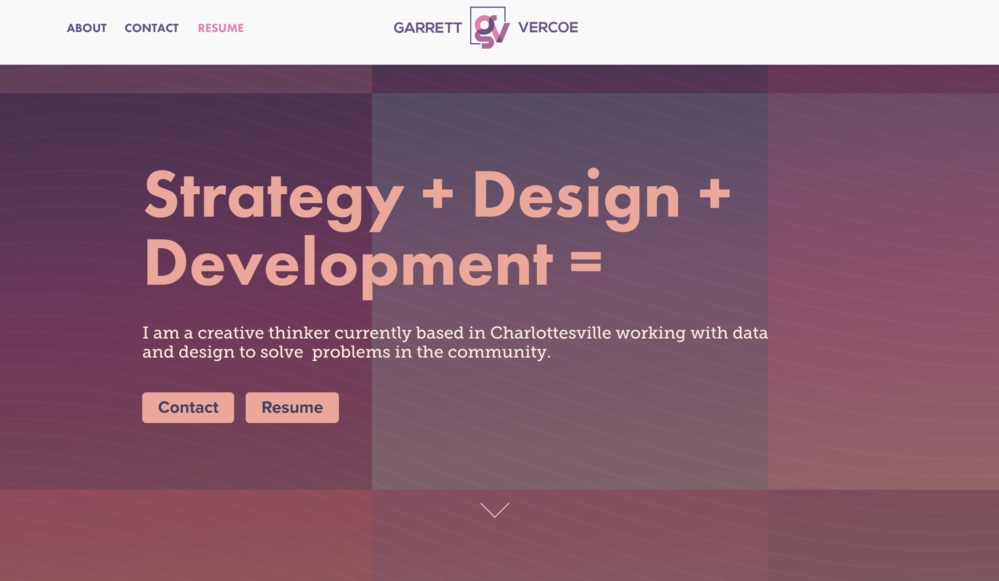

## Well this is a bit meta.

Working with clients over the years, nearly all of them will want a website that they can continually update on their own without use of code. Because of this, projects always end up using a CMS like WordPress or SquareSpace, and I don't end up using HTML/CSS/JS as much as I like. While these softwares serve their needs, as a designer I've been itching to try newer front-end frameworks.

# process

## To teach myself React, I built this site from scratch.

In the end, I learned and used more platforms than anticipated. In a nutshell, this website works where each page is a React component, and there are other components that are pulled into each page. Each page section is a folder of markdown files, where a component queries the data and makes a grid of that folder, and another template component converts the markdown to their own pages.

# React

The front-end framework for this website.

# GatsbyJS

A static site generator I use to turn my React files into static html, css, JS. This allows me to host the site for free on Github Pages, with faster load time and less server dependencies.

- More on [GatsbyJS](https://www.gatsbyjs.org/)
- More on [Github Pages](https://pages.github.com/)

# GraphQL

GraphQL is a query language that allows me to pull data to my components, and is essential for converting my markdown files into static HTML.

- More on [GraphQL](https://graphql.org/)

# Markdown

To ease the time it takes to build project pages, I created a template component to translate markdown pages to HTML using [Remark](https://github.com/gatsbyjs/gatsby/tree/master/packages/gatsby-transformer-remark), and each markdown file has extra fields to query from for other pages.

# The rest

As for other dependencies, there's not much! I used [Semantic React UI](https://react.semantic-ui.com/) to make the grids, but all other CSS was made from scratch and I didn't use any pre-made React components.

If I get any following questions about the site, I will add more detailed sections to this page. I can also add the React files to a Github repo if there is any further interest. The static files are hosted [here](https://github.com/garrettvercoe/garrettvercoe.github.io).

My site's changed a lot over the years. Here's some earlier iterations. They looked good but took way too much time to edit and add projects.

