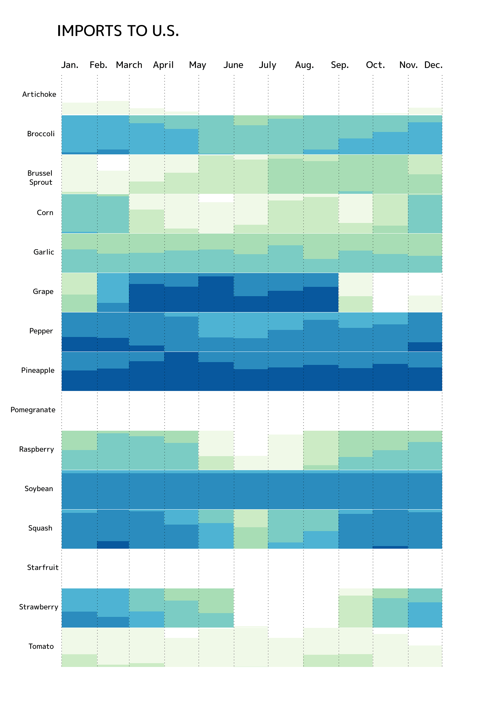
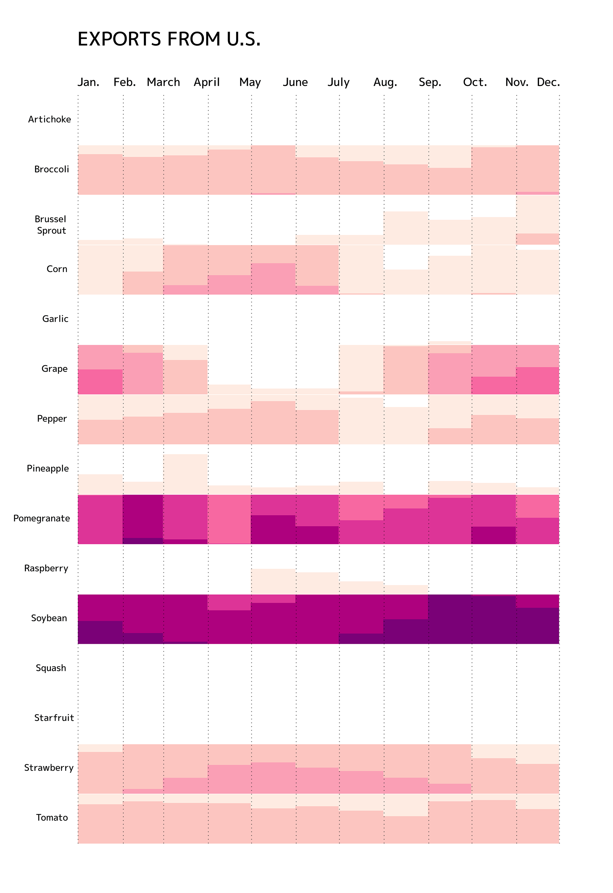
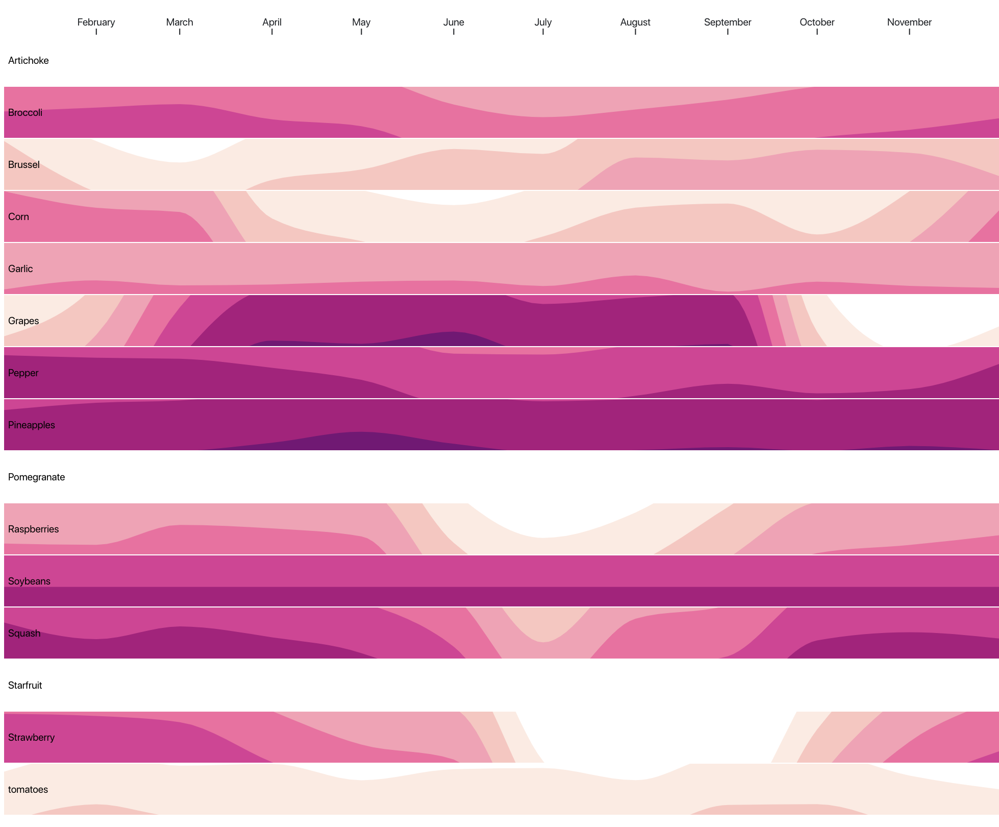
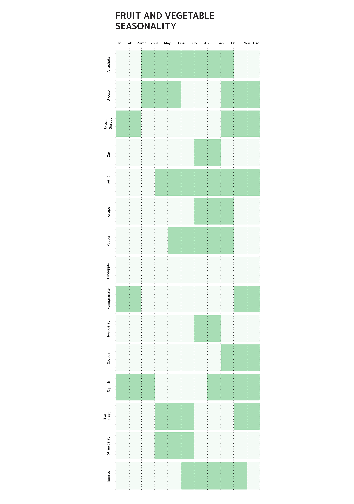

# The Process

For a museum exhibit on fruits and vegetable, I was tasked with comparing the seasonality data of each vegetable/fruit featured in the exhibit. I created a stacked histogram plot to compare the import and export data of each vegetable on a year time-scale.

You can view the D3 code here: [Source Code on Observable.](https://beta.observablehq.com/@garrettvercoe/imports/2)

# Reading the graph

This is a boxed histogram, and the histogram is stacked when it overflows its container. Thus, a darker color is created where imports/exports are higher, as the histogram is at a higher density.

Here's an earlier iteration of the chart:

And here's a graph showing the months each fruit/vegetable is in season in Virginia (as that is where the exhibit was on display).

