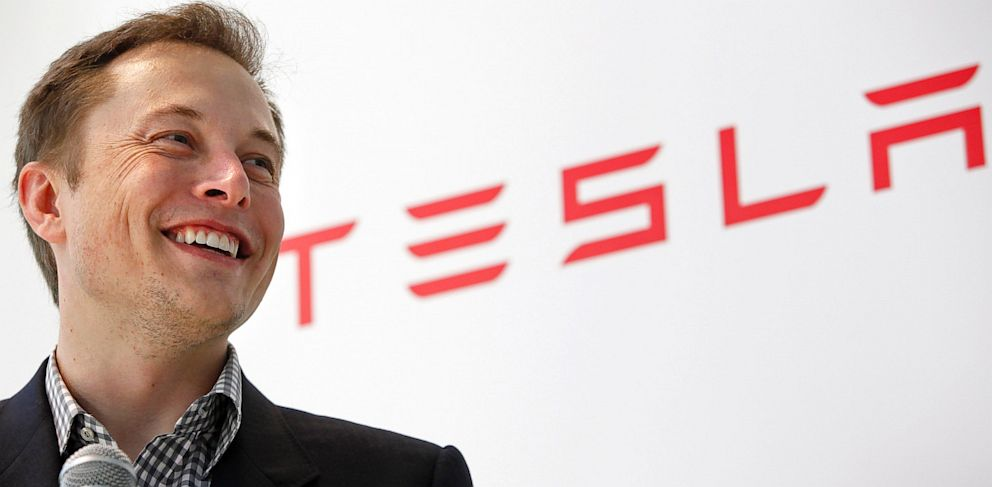
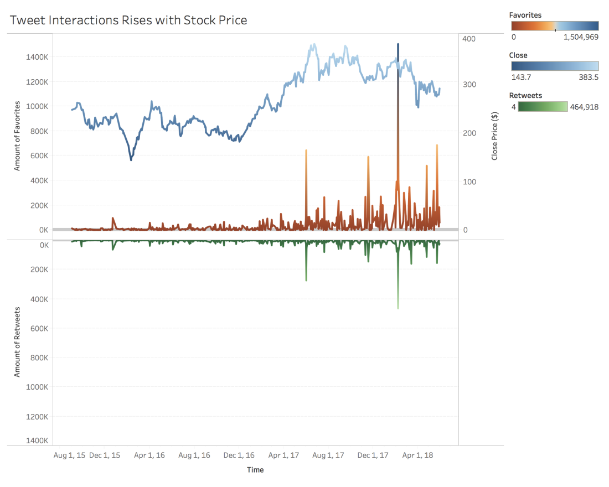
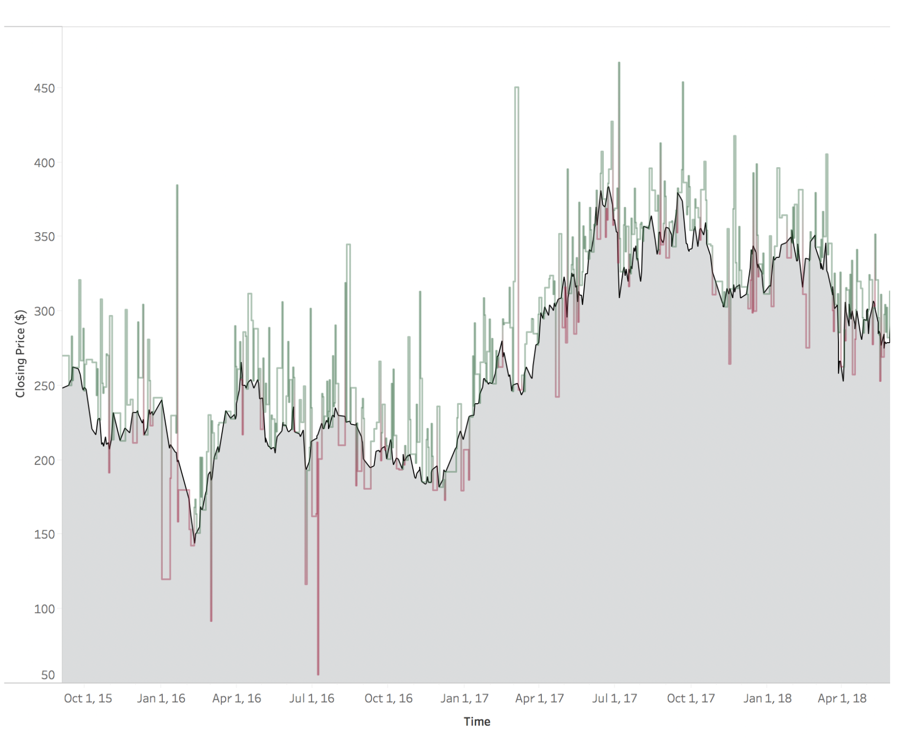
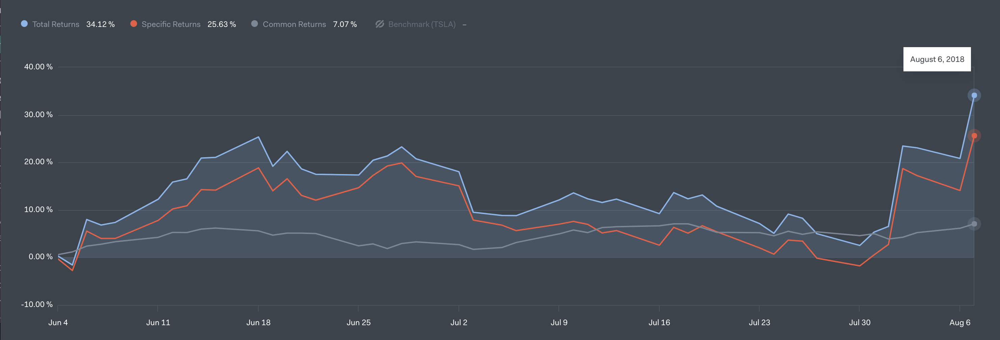

Elon Musk's twitter began hitting the national media with a tweet saying he would make Tesla private if reaching \$420 on August 7, 2018. This algorithm our team created we presented at the Data Science Institute at UVA on June 4, 2018, **two months prior to this tweet**. So we were correct on our hunch!

<iframe frameborder=0 height=150 width=550 
 src="https://twitframe.com/show?url=https://twitter.com/elonmusk/status/1026872652290379776?ref_src=twsrc%5Etfw%7Ctwcamp%5Etweetembed%7Ctwterm%5E1026872652290379776&ref_url=https%3A%2F%2Ftwitframe.com%2Fshow%3Furl%3Dhttps%3A%2F%2Ftwitter.com%2Felonmusk%2Fstatus%2F1026872652290379776"></iframe>

Elon Musk tweets a lot more than the above tweet, and much of it is uncensored and can be emotionally charged. Our team noticed that Tesla stock price seemed to be sensationalized and media-driven.

<iframe frameborder=0 height=250 width=550 
 src="https://twitframe.com/show?url=https://twitter.com/elonmusk/status/848244577521647616?lang=en"></iframe>

 <iframe frameborder=0 height=150 width=550 
 src="https://twitframe.com/show?url=https://twitter.com/elonmusk/status/810108760010043392?lang=en"></iframe>

# scraping & mining

## To see the correlation between Tesla stock and the media, we scraped Elon Musk's Twitter.

Using the Twitter API, we scraped 3,473 of Elon Musk's tweets, from the period 2015-2018. Writing in python, we used [Tweepy](http://www.tweepy.org/) to get access. We pulled favorites, retweets, amount of replies, date, and content for each tweet.

As it was a messy JSON file, we cleaned each tweet to create a list of words used per tweet. We removed unnecessary words like @handles and hyperlinks using regular expressions.

```python
stop_words = set(stopwords.words('english'))
# set of punctuation
punctuation = set(string.punctuation)

# stemmer object
stemmer = PorterStemmer()
from nltk.tokenize import RegexpTokenizer

def clean(doc):
    # Remove stop words
    name_free = \
        ' '.join(re.sub("(@[A-Za-z0-9]+)|([^0-9A-Za-z \t])|(\w+:\/\/\S+)|rt"
                 , '', doc.lower()).split())
    stop_free = ' '.join([term for term in name_free.split() if term
                         not in stop_words])

    # Remove punctuation
    punc_free = ''.join(term for term in stop_free if term
                        not in punctuation)
    stemmed = ' '.join(stemmer.stem(word) for word in punc_free.split())
    return stemmed

# clean every document in the corpus
clean_content_list = [clean(doc).split() for doc in content_list]
```

# sentiment analysis

## For each tweet, we created a sentiment analysis score based on word usages.

Sentiment analysis is basically assigning a polarity to a word. Using the word "hate" gives a negative score, such as -5, while "great" gives a positive score, 5. We summed the polarity of each word in a tweet to get the total score. From this, we can tell if a tweet was negative, positive, or neutral.

# interactions

## The more favorites and retweets Elon Musk gathers, the higher the stock price.

You can see that when there's a huge jump in favorites/retweets, a large change occurs in stock.



One thing to consider is that this correlation may not be causational. However, we also looked at what Musk talks about most in each tweet, and they primarily center on Tesla (with the word Tesla and its car models being used in 25% of tweets). This shows a likelihood for causation.

# findings

## Sentiment analysis scores also vary with stock wellbeing.

The black line is the Tesla stock price, and the green and red above and below the line is a normalized sentiment analysis score for that day. The negative scores occur before or during a dip in price, and the extremely positive scores occur before large jumps in price.



# Algorithm

## From these findings, we created a trading algorithm that trades based on Musk's tweets and their sentiment scores.

Using python and Quantopian, we created an algorithm that would check for tweets by the day.

- If the scores were positive, the algorithm takes a larger holding in Tesla.
- If it was negative, it would sell part of its holding.
- If it was in a neutral range, it would hold.

# Does it work?

## The algorithm beat the market by 6%.

Running the algorithm from the time we made it, June 4th, till August 7th where it sold all holdings, we made a 34% return. If we had just bought and hold Jun. 4 - Aug. 7, it would have been a 28% return.



The trading algorithm has more potential to be refined. Right now the buying and selling strategy only takes sentiment scores into account, which can be extremely volatile. Only looking at tweets per day makes the algorithm a small lag behind the market. Looking at tweets in constant time and computing scores could create bigger returns.

This idea can be extrapolated to many other figures, such as Donald Trump for the S&P, or other CEO's who speak openly.
