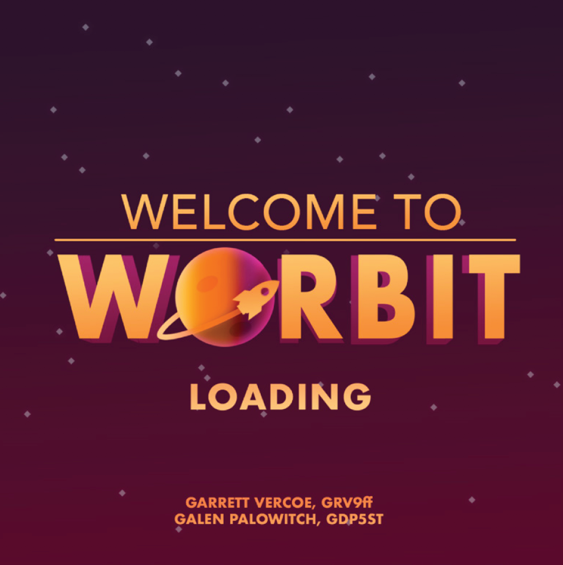

# The Process

Working in a team of two, we developed and designed a game where the main player was placed in a natural gravitational orbit around the sun.

# The Outcome

We created a game where the physics and animation were made from scratch in Python that users greatly enjoyed. We still have people a year later asking us if they can play it.

# My Role

I worked on designing and animating the game with custom-made sprite-sheets while my teammate worked on developing the physics engine of the game system.

# How to Play

You can change your orbit to avoid incoming enemy ships, but if you get too close to the sun you'll burn up. The main strategy is to last for as long as possible to get a high score. Kill incoming enemies by blowing them up with your thermal charge or changing their orbits to direct them into the sun.

Check out the source code repository on [Github](https://github.com/garrettvercoe/Worbit)

# Proof of concept

<iframe src="https://player.vimeo.com/video/249009955" width="640" height="642" frameborder="0" webkitallowfullscreen mozallowfullscreen allowfullscreen></iframe>

# finished version

<iframe src="https://player.vimeo.com/video/249025649" width="640" height="640" frameborder="0" allowfullscreen></iframe>
