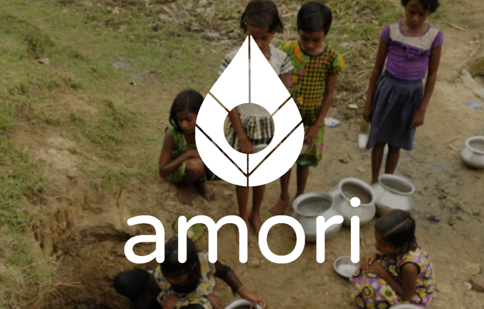
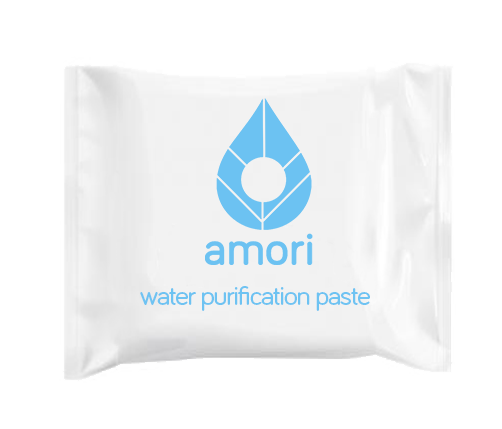
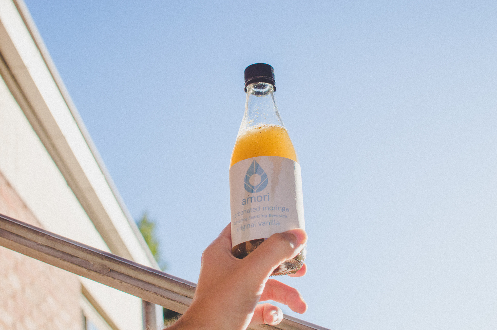
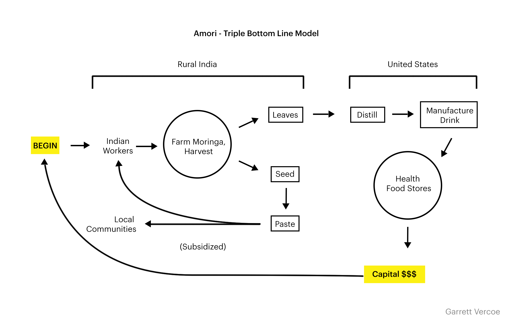
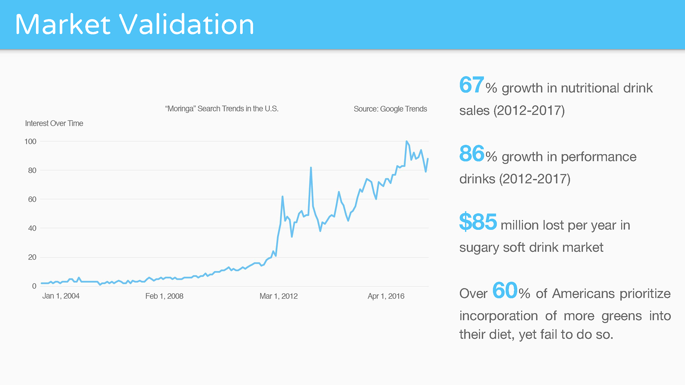
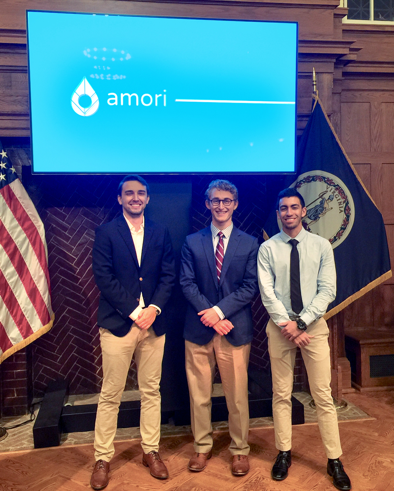

# Problem

## **63 million people in rural India are without access to clean water.**

Over 20,000 habitations have been impacted by the contaminants in the water such as iron and arsenic. The Indian water crisis has led to 37 million people annually diagnosed with disease, and as a result, has also led to the death of almost 200,000 children per year. Current solutions aren’t working. Water treatment plants are largely unmaintained and perform poorly. Studies indicate that over 50% of plants are considered poor or very poor, while only 10% are labeled good. Small scale solutions, on the other hand, are barred by extensive shipping and manufacturing costs. The average family wage for 75% of rural Indians is only \$3 a day, meaning these current solutions are very unaffordable.

# Solution

## Our team developed a plant-based paste that coagulates and removes contaminants in water.

The method we discovered is extremely cost-effective, so much so that about 100 liters of water can be filtered for about 14 cents. The paste does not necessitate construction and maintenance of sanitation infrastructure, nor does it require importation of expensive chemicals. It is grown, packaged, and distributed all within India, which allows Amori to manuever around difficult transportation infrastructure. At the user level, It is extremely simple to use so that adoption is easy.

# Process

## Moringa Oleifera, a type of tree, is abundant and endemic to rural India.

The seeds of the Moringa tree, when powderized, act as a coagulant, antimicrobial, antifungal, and sanitizing agent. When put into a paste, it is effective in reducing the turbidity of water to WHO standards for consumption.

# Plan to market

## We've created a drink using leaves from the Moringa tree.

To have this approach be feasible, there needs to be a means of raising capital. While a charity approach could work, moringa offers other aspects for creating revenue. The leaves of the moringa tree are extremely nutrient dense, having all 9 essential amino acids and twice the nutrient profile of kale. Our moringa drink is fizzy and has other healthy ingredients such as apple cider vinegar, honey, lime juice, and water. It would be the first moringa drink to market in the US. The VC's that have tried it love it!

# Market

The market for Moringa is picking up in the United States too over the past several years, but current competitors have mainly stayed to selling the leaf powder to put into capsules or shakes rather than turning them into food/beverages.

Amori was declared a finalist for the University of Virginia Entrepreneurship Cup for the concept stage in the beginning of 2018. We presented to several social entrepreneurship venture capitalists and are continuing to work on the venture.

