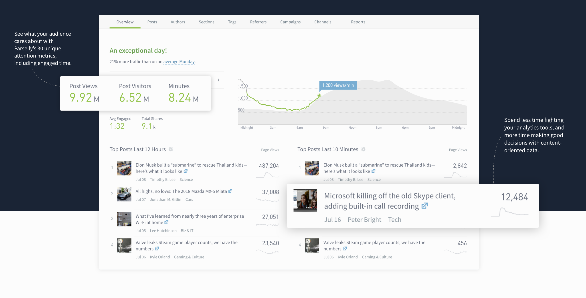
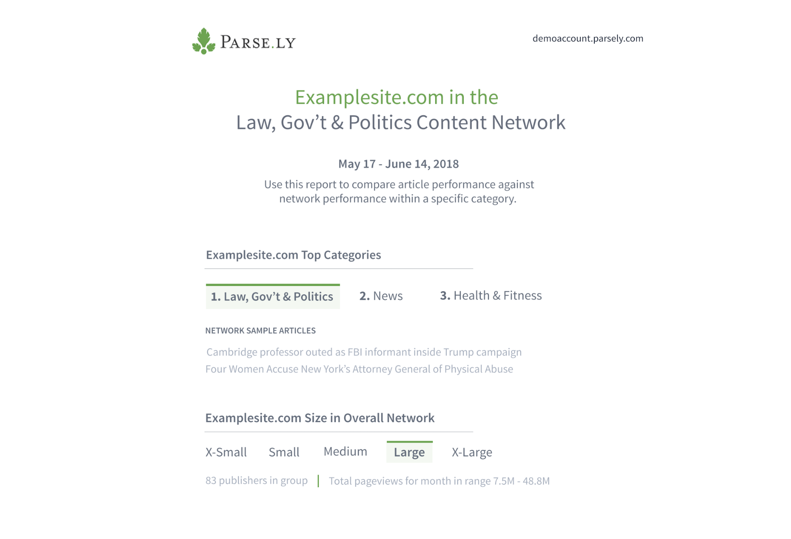
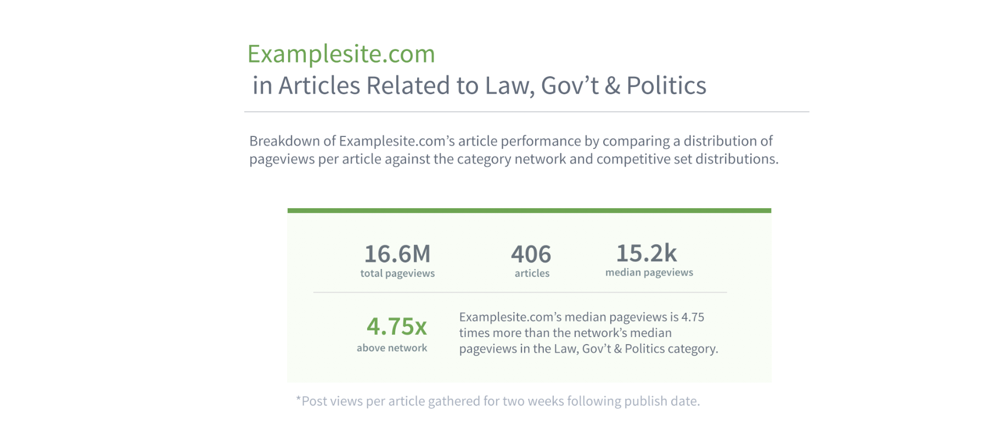
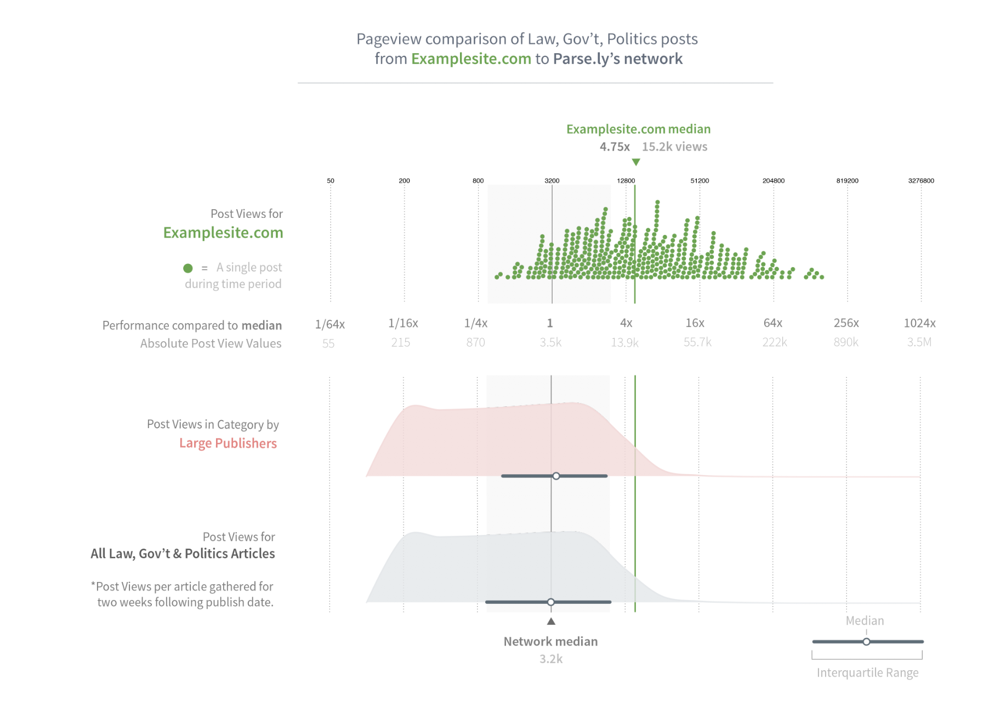
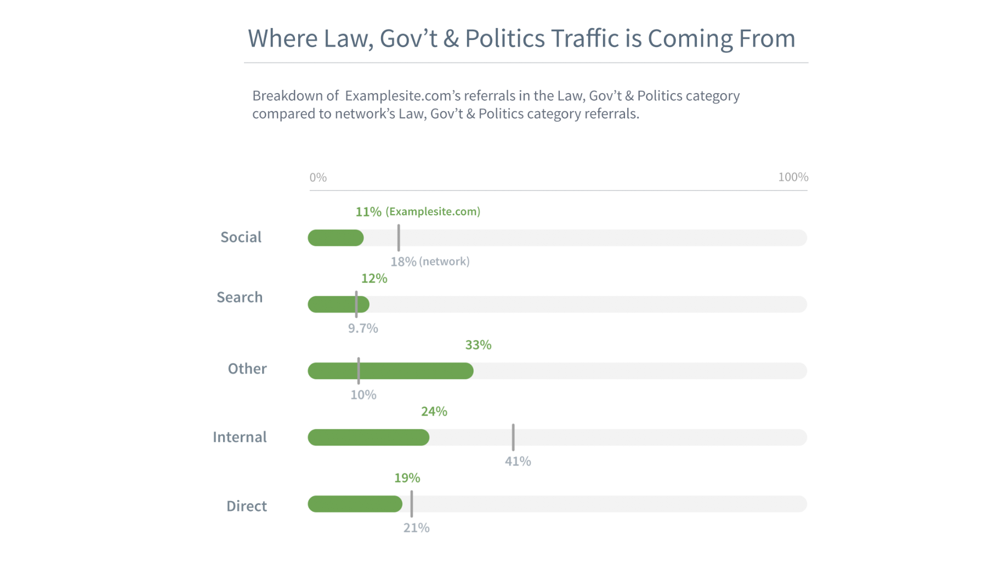
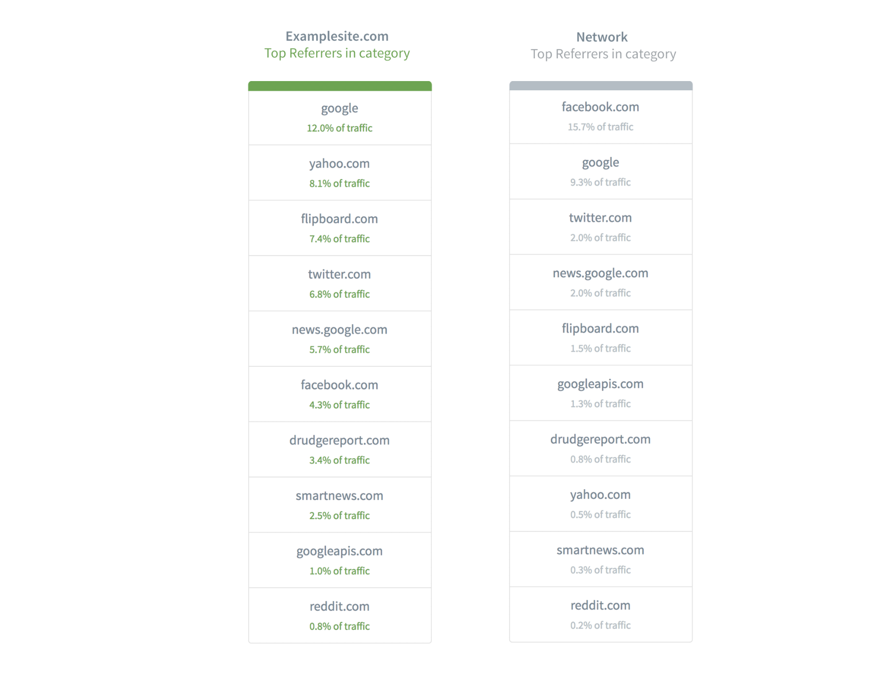
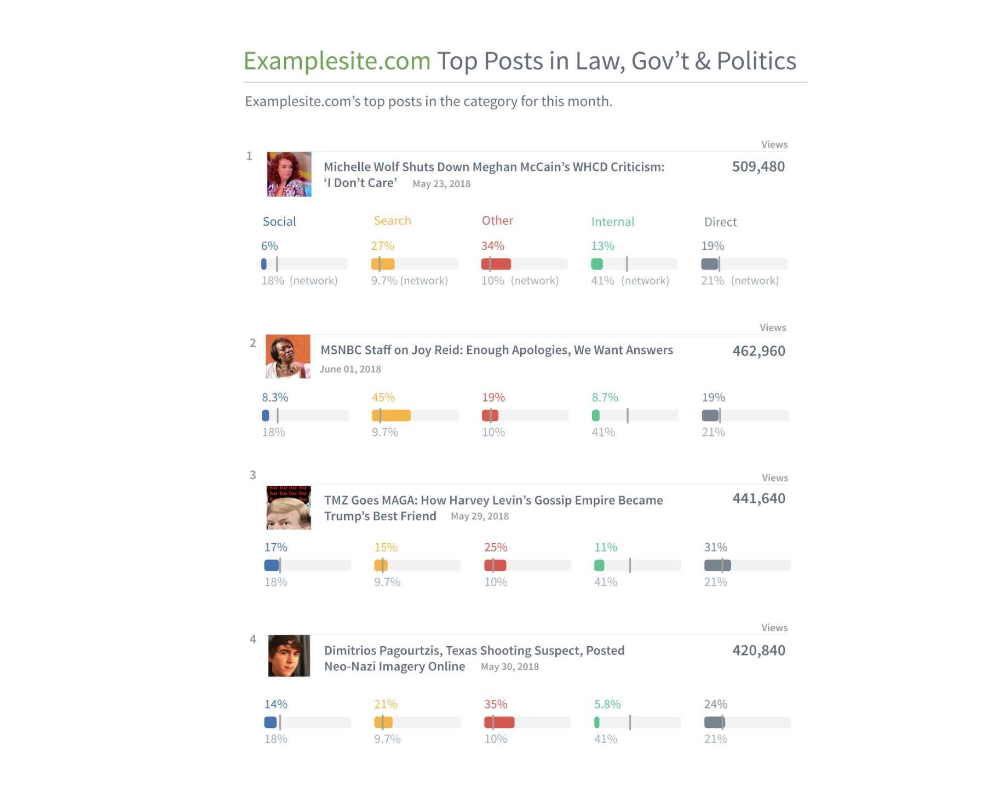

# Context

**I worked as a data scientist intern at Parse.ly for the summer of 2018 and this was my primary project**. [Parse.ly](www.parse.ly) empowers companies to understand and improve digital audience engagement through data. They are a SAAS company that offers a suite of services that helps top news sites measure audience attention and view internet attention trends from over a billion people.

Top news companies like Conde Nast, Ars Technica, and the Wall Street Journal use Parse.ly to learn of real-time attention shifts for the content on their sites.

# Problem

## Sites have over 30 metrics to generate insights from, but can only compare metrics to their historic overall performance.

With current Parse.ly software, a site such as the New Yorker sees that they have 'X' amount of views on their articles, but they cant easily compare articles from their Business section to their Politics section. They also can't compare their Politics section to the politics section of other publishers on the web.

# Solution

## Using Python and D3, I created a prototype web application that allows publishers to compare metrics against their competition.

The prototype I created helps give a benchmark of where a single publisher stacks up in a sea of publishers. A site can compare how they're doing in any category, and compare that to their own historical record and the performance of a large portion of publishers on the web. I used Python in the backend to automatically pull and create a unique dataset for each customer that generated a report, and D3 to visualize the data on the front-end.

# Features

## Look at a content category of your site, and see how it performs for a specific time range.

This section uses reports generated for a variety of customers, with names redacted to retain customer privacy.

See what categories are performing the best for the time period selected, and what stories people from the network are writing about for that category. See what size you are in the overall network, determined by total page views.

## Discover content metrics for a category, and how it compares to the network median.

View each individual post for the category, see how it compares to your own distribution, the distribution of publishers of a similar size, and the distribution of the entire category.

Reading the above graph, you can see that examplesite's performance is nearly 5 times greater when comparing median to the overall network. They may then want to view the content for the set of posts that did 100x better than the median, for example.

---

## See traffic source breakdowns for the category chosen.

See how much of your traffic comes from search engines or social media, and how those metrics compare to the network averages for that category.

In addition, look at traffic sources in even finer detail by looking at top referral sites for a category.

## Look at top posts performance in a category, and traffic breakdowns for each.

## View historical performance of your category compared to the network.

At the time of prototyping, I only had a few months of data to pull from as it was very new. Months later, it's now possible to get more aggregate data for this section.

# Outcome

## This prototype turned into its own software and is releasing in early 2019.

Rather than making the prototype a feature in the current software, after I left the team decided to turn it into its own software for new customers. As it is before release, I can't share any relevant code due to privacy concerns.
