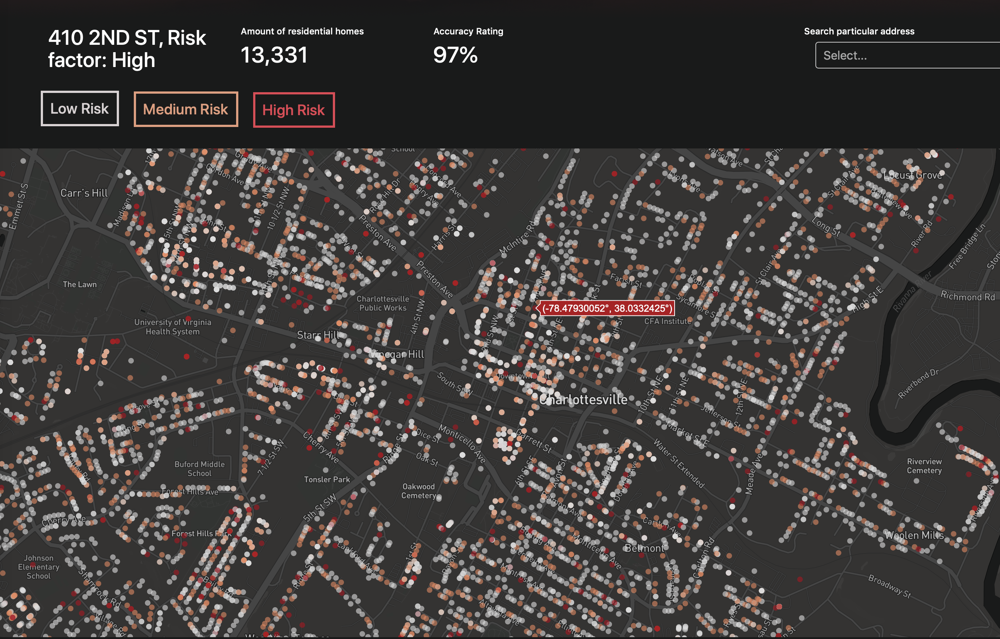

# Intro

## To go right to the implementation:

- <a class="bodyLink" href="http://charlottesville-fire-help.herokuapp.com/" target="_blank"> Finished tool </a> now in use by the fire department (may need to wait a few seconds for the data to be pulled from the server)
- The <a class="bodyLink" href="https://github.com/garrettvercoe/CharlottesvilleFireModel/blob/master/Application/src/app.py" target="_blank">javascript source code </a>for the web-tool
- The <a class="bodyLink" href="https://github.com/garrettvercoe/CharlottesvilleFireModel/blob/master/fire_machinelearning.py" target="_blank"> python source code </a>for the data cleaning + machine learning classification

# Problem

## The Charlottesville Fire Department doesn’t know which houses to inspect.

3 _week full-time project. 4 members._

The Charlottesville Fire Department regularly assesses fire risks to life and property. Their current process is primarily heuristic-based, and **success ratings are only around 20%** . There are tens of thousands of buildings in Charlottesville and many are old and need to undergo inspection. The department only has three employees to do these inspections however, so it becomes impossible to inspect them all in a timely manner. Thus, they needed a better way to know which buildings to inspect first.

Three other UVA students and I teamed up to tackle this issue, initially at a [WillowTree](https://willowtreeapps.com/) & Smart Cville hackathon dubbed "Civic Innovation Day", but we were asked to continue working with the fire department to see the app through fruition.

# Solution

## There is a large amount of residential, commercial, and fire data that is available but not being used.

Charlottesville has a huge amount of GIS building data that is open to the public [here](http://opendata.charlottesville.org/), but it isn't used to its full potential. In addition, the fire department itself has decades of private fire occurrence data, but the data was uncleaned and hadn't been used.

We took all of this data, cleaned it, and put it through a machine learning algorithm to classify each building as high, medium, or low risk.

**What we looked at**:

- 2,508 commercial homes
- 14,054 residential homes
- 1,713 historical fires + how they were caused
- 331 fires within the past few years

**We looked at 34 variables variables for each building, such as**:

1. Square footage
2. Year Built
3. Basement
4. Total Rooms
5. Gross Area
6. Use Code
7. Number of Stories
8. Type of exterior walls

After doing a gains analysis on the variables with cross-validation, to prevent over-fitting of the algorithm we only looked at the 20 top factors per building.

We tried out several models, such as bagging and simple decision-trees, but the best performance was with a random forest regressor that we customized.

# Results

## With our random forest regressor, we achieved a 97% accuracy rate at correctly predicting high-risk buildings.

Once the model was completed, I created a web-interface over a 2 day period so that the fire department could use and make sense of the data easily, using a custom mapbox script.

The links at the top of this page go into way more detail of the actual implementation, and some of the cautions to taken into account with the data. I encourage you to check it out!
