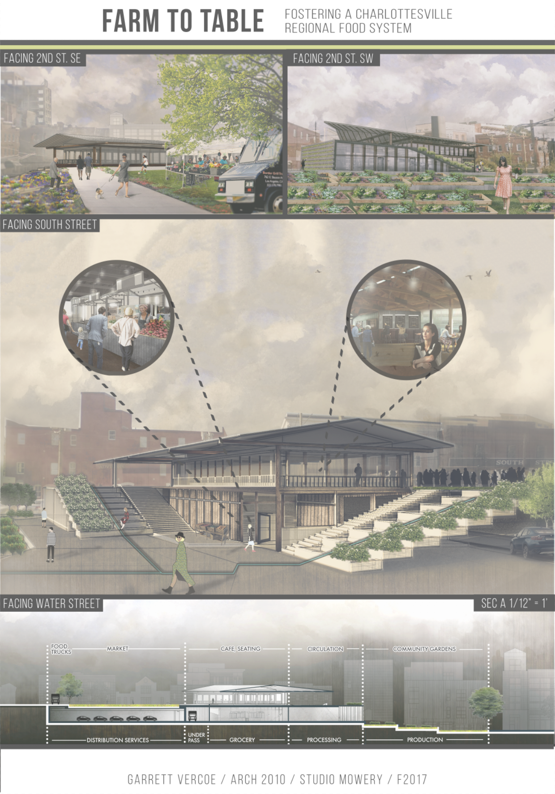
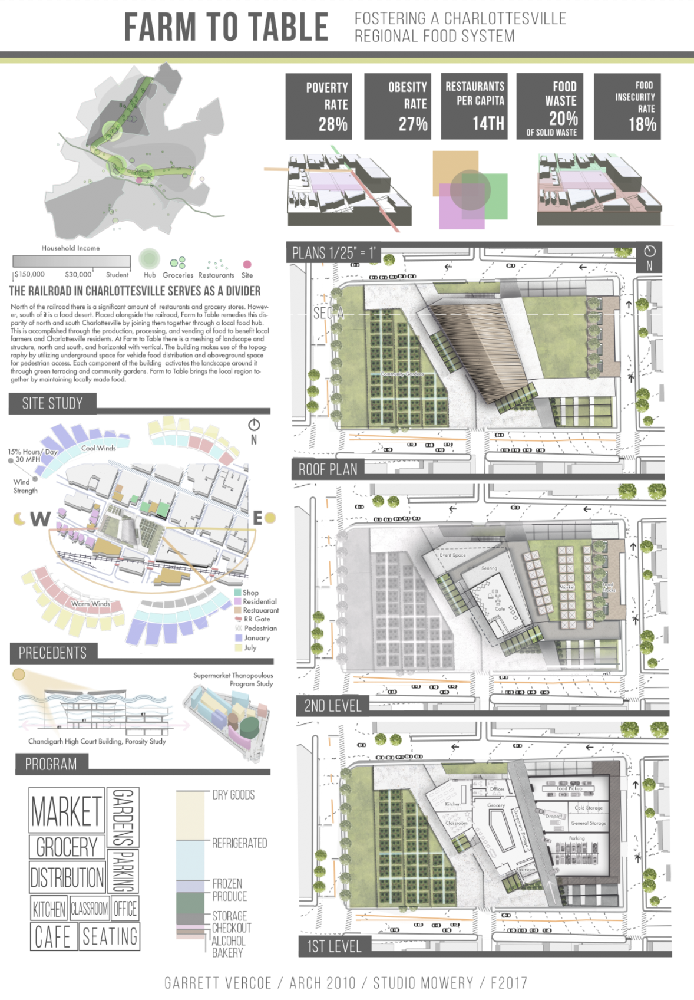
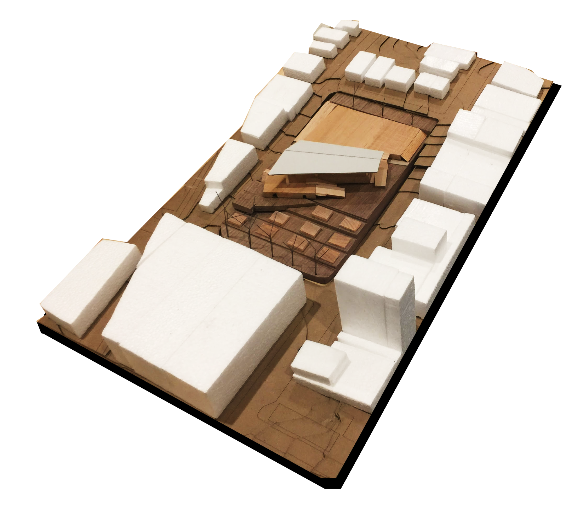

# **The Challenge**

In downtown Charlottesville there is a two-block empty parking lot where the Charlottesville Farmer's Market occurs on Saturdays. I was tasked to redevelop the site to activate the surrounding site while paying respect to the surrounding city context.

# The Process

Due to the site needing to activate the local area, half of the time spent on the project was devoted to researching the surrounding site by local, neighborhood, and city-wide scales. Every decision that went into the design of the multi-purpose site originated from its surrounding context.

# The Outcome

The site developed creates a sustainable and regional food distribution system that benefits farmers, small businesses, and consumers of both high and low incomes. The site remedies the food insecurity disparity between north and south Charlottesville through providing food production, processing, and distribution assets for local citizens. The architecture responds to the needs of the programs and the surrounding community.

# My Role

This project was completed individually but I teamed up with a colleague for the initial downtown Charlottesville drawing, gathering geographic data, and the modeling of the surrounding site.

