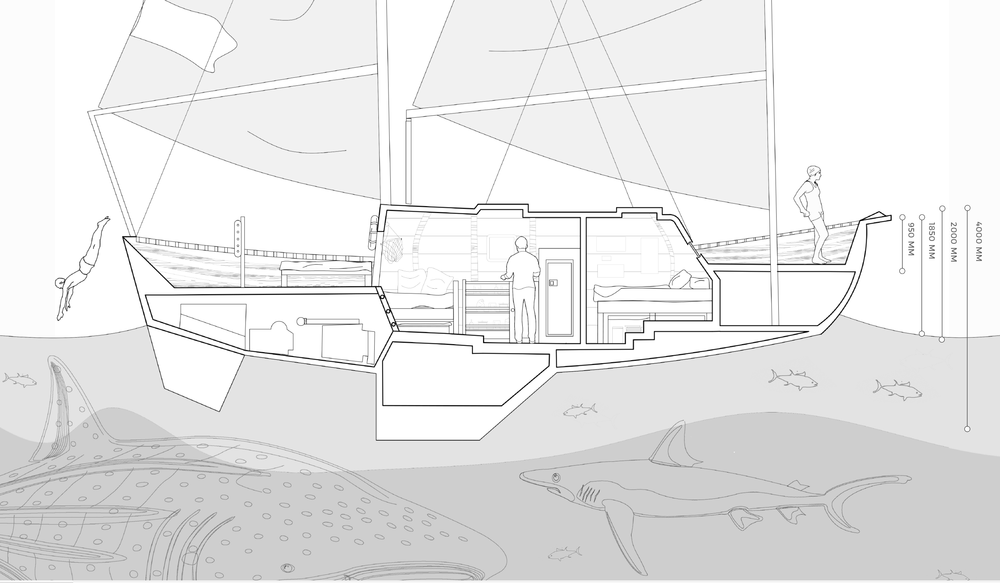
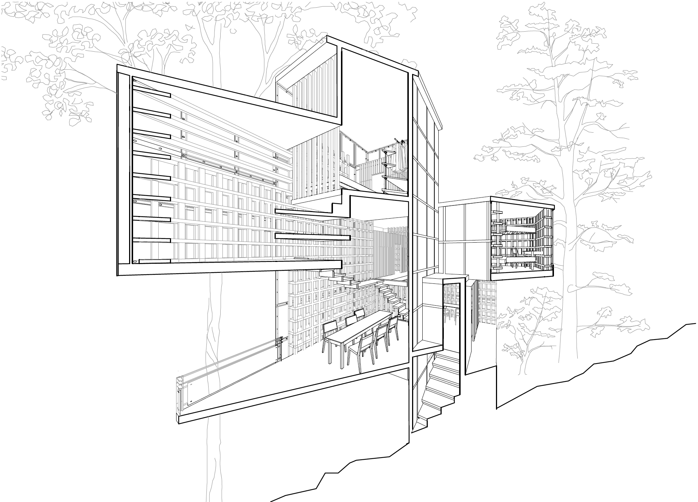
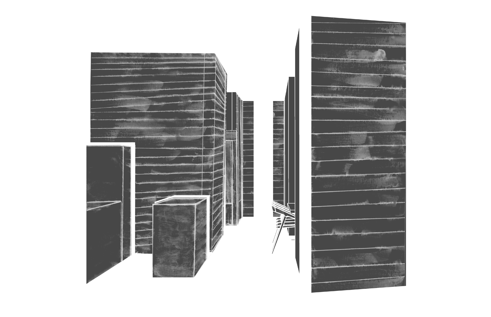
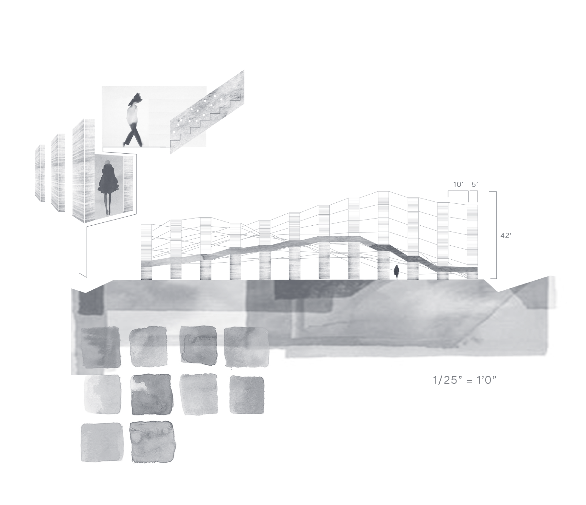
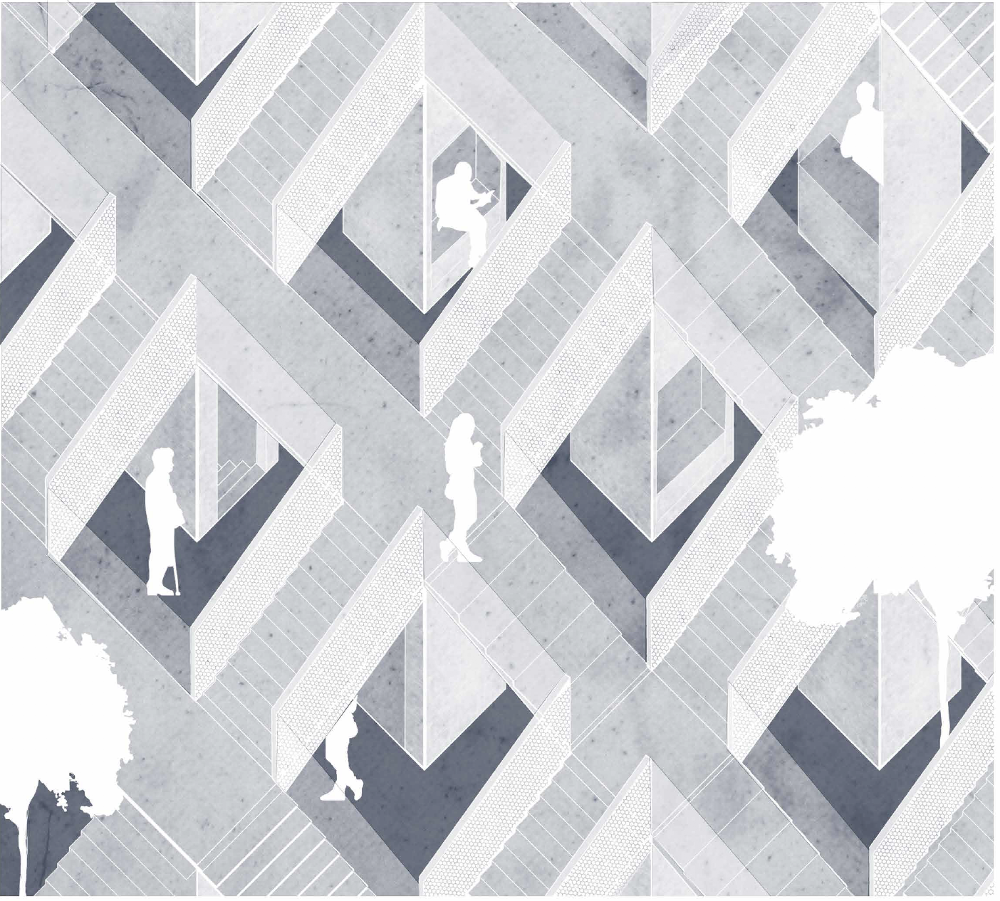
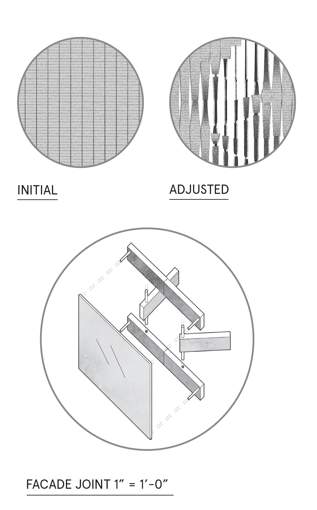
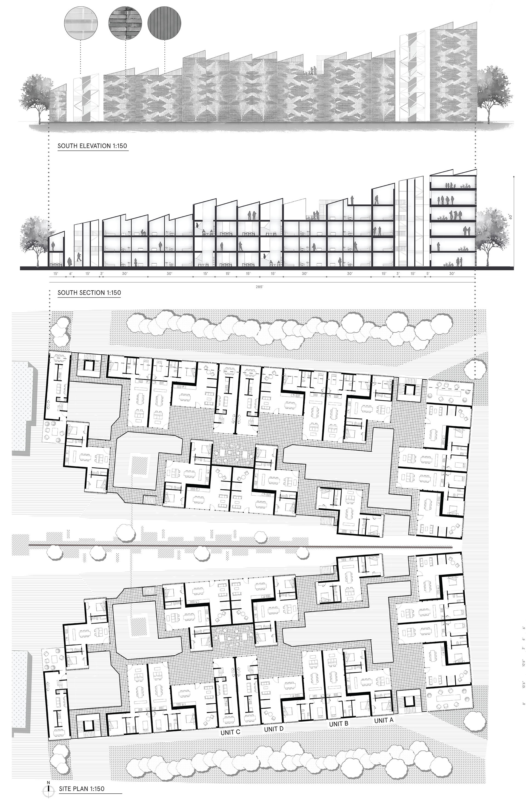
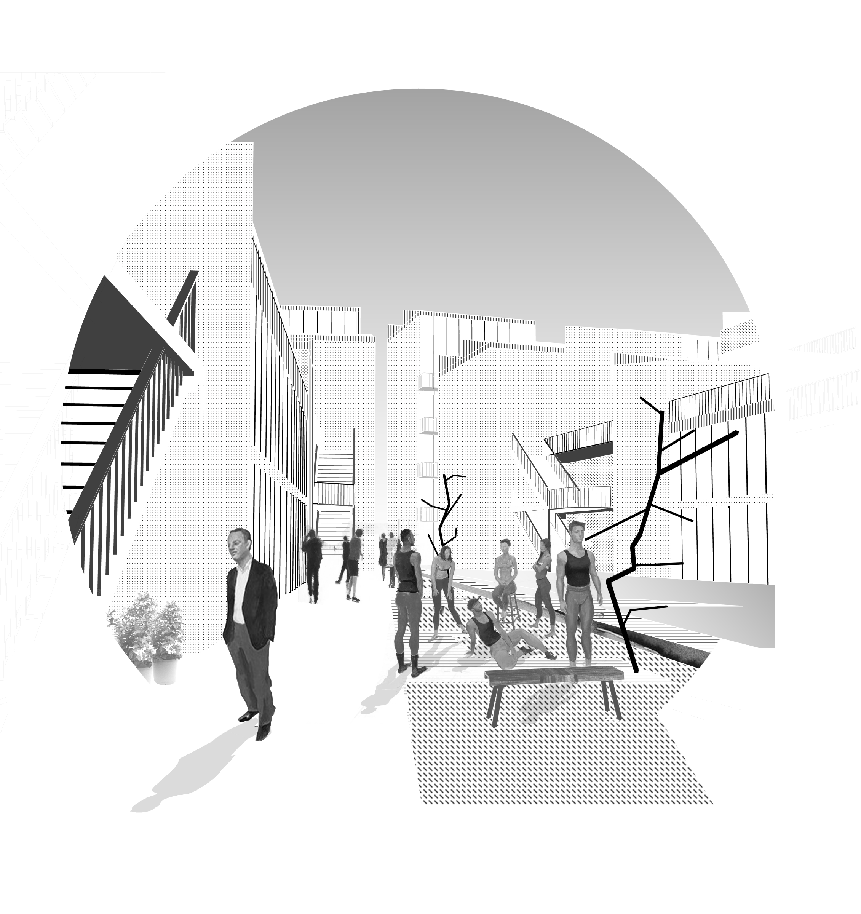
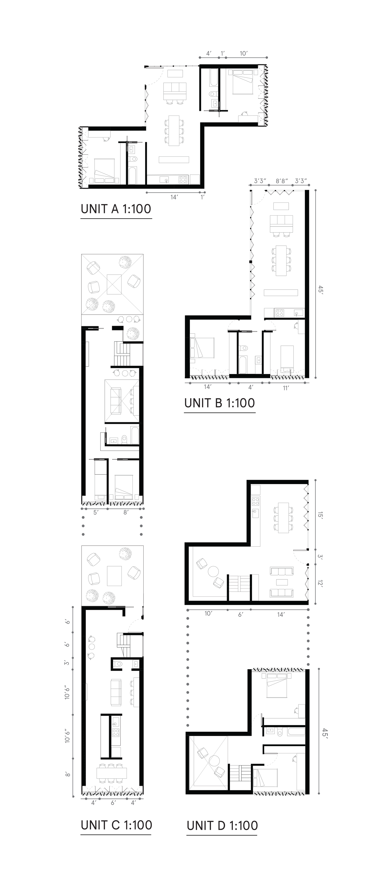

# Context

This semester-long housing studio began by looking at the human scale and minimal spaces of inhabitation, and from there went to the scale of the city. The booklet below shows all of the process projects prior to the final housing apartment complex designed in DC, with the final project below it.

# Process Work

A quick dissection of my process work:

1. Exercise 01: Detailed drawings of my own living space at the time
2. Exercise 02: Detailed drawings of a space that uses minimal square footage for living. I looked at the domesticity of living on a boat.
3. Exercise 03.01: Housing for monks who live in silence
4. Exercise 03.02: Housing for the blind
5. Exercise 04.01 : Complex multilevel house with maximum 200 sq feet touching ground level
6. Exercise 04.02: Reimagining a staircase

You can view these below:

<iframe src="https://e.issuu.com/anonymous-embed.html?u=garrettvercoe&d=final_book" width="944" height="500" frameborder="0" allowfullscreen="true"></iframe>

## Selected Drawings

# Main Project

## After studying, researching, and producing smaller works of how people live, I moved onto creating a larger scale housing complex.

This project is in Columbia Heights, DC.

The inspiration for the complex is a rock being carved away. The outer facade of the building is solid like a rock, made of brick. However, each apartment unit has the ability to rotate the bricks to let in light when needed. This creates an eroded, undulating rock face on the exterior which constantly changes.

The jagged rooftops also hint towards the breaking open of the rock-face as someone enters into the complex. The arrangement of space creates different pockets of interaction. The central courtyard allows all to gather and interact, and there are smaller courtyards around the complex to allow for more neighborly interaction. Each unit block has a different amount of levels, and this creates an exterior multilevel interaction.

There are four different types of units, with two of them being two-storied. Each individual unit has a retractable wall that always faces the inner-courtyards of the complex or gardens, to help create a liminal threshold between interior and exterior. At the grand plan, they are arranged to maximize light between each unit.

