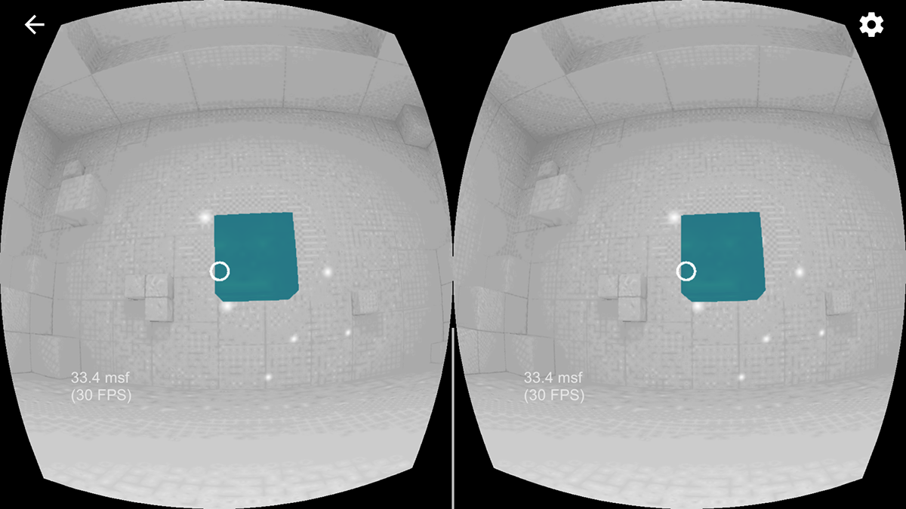
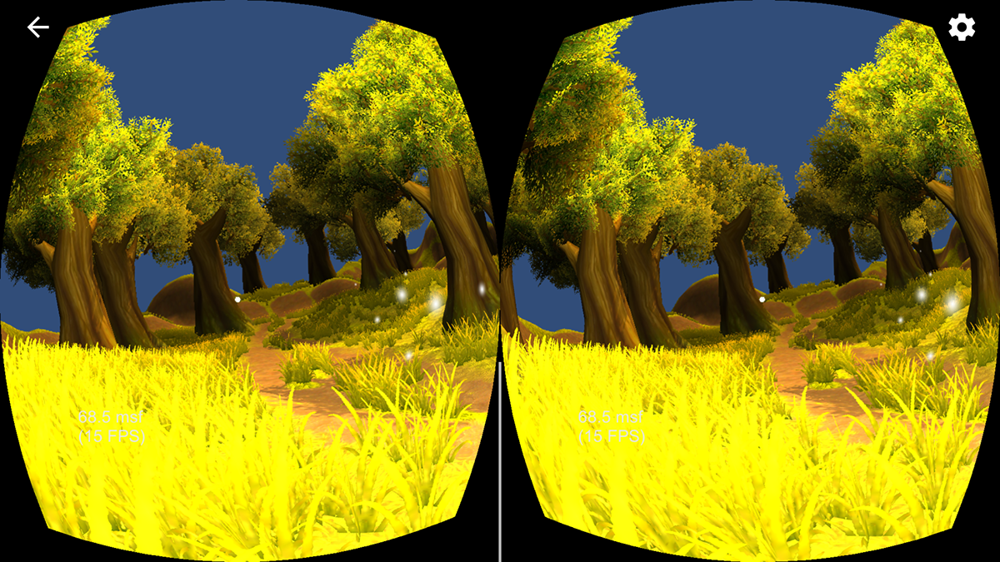
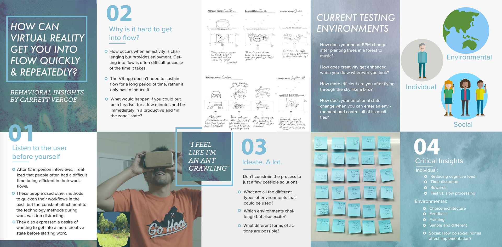
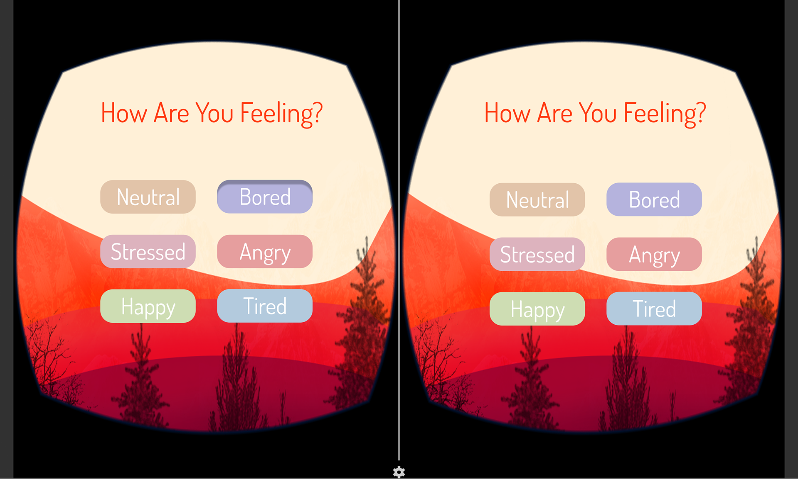

# Problem

## People are estimated to waste 2 hours a day at work from distractions.

One of the best solutions to this problem is being able to achieve flow, a state of complete immersion. I sought to tackle how to better achieve flow through independent research under Dr. Leidy Klotz.

# Parameters

## I became interested in how virtual reality could induce flow in a quick and repeatable manner.

After doing research in the behavioral insights needed to achieve flow primarily from Mihaly Csikszentmihalyi's "Flow", I found that a user's environment needs to induce:

- Challenge
- Creativity
- Reward
- Surprise
- Clear Goals
- Control

With virtual reality, a designer can completely control one's environment. Thinking that by making a setting in which all of these things are possible, a person could induce flow quickly and effectively.

# Working with VR

Coding in C and using Unity, I began prototyping various models to achieve flow. I began with just having a simple activity of a box appearing randomly, having the user find the box and "pop" it, where it would then appear somewhere else.

## You are an ant in a forest.

Taking this controlled activity, I added a forest with relaxing symphony music. The boxes randomly populated in this forest and you had to find them. Being an ant allows for a fresh, surprising perspective shift, in a relaxing environment.

<iframe class="embed-content" src="https://www.ccv.adobe.com/v1/player/ccv/CQKhE8xXTqP/embed?bgcolor=%23191919" width='560' height='400'></iframe>

<iframe class="embed-content" src="https://www.ccv.adobe.com/v1/player/ccv/AiczBnUR3LI/embed?bgcolor=%23191919" width='560' height='400'></iframe>

Here's a board of takeaways from this initial iteration:

## I based success on achieving flow on two factors: heartbeats per minute, and qualitative feedback.

While people felt relaxed by this app, they didn't feel a state of flow. It lowered their hear rate, but didn't keep them engaged. This was due to not having enough control of the environment, and not giving a challenge.

# final iteration

## Inline: A VR app with a three-part method of meditation, creativity, and exhilaration.

This game works by drawing out a path that you want to ride along with, similar to the Line Rider game. You draw out a path with your eyes, and then actually ride down that path in 3 dimensions.

<iframe width="560" height="315" src="https://www.youtube.com/embed/fF5cTdd5o9g" frameborder="0" allow="accelerometer; autoplay; encrypted-media; gyroscope; picture-in-picture" allowfullscreen></iframe>

One of the key aspects to this is that the physics engine and settings are defined by your emotional state. The above demo is for someone bored.

- If you say you are stressed, you will be placed in a relaxing beach-side setting, and the ride will be nice and slow with soft music.
- If you are bored, the music will be a pump-up song, you will be in the mountains, and will ride the path as if its a roller-coaster.

This way, the user can fully control the experience they want. The game could be challenging, it could be nice and slow. It allows the user to do what they need to achieve flow. By drawing your own path, you can be as creative as you want, and give yourself the experience.
