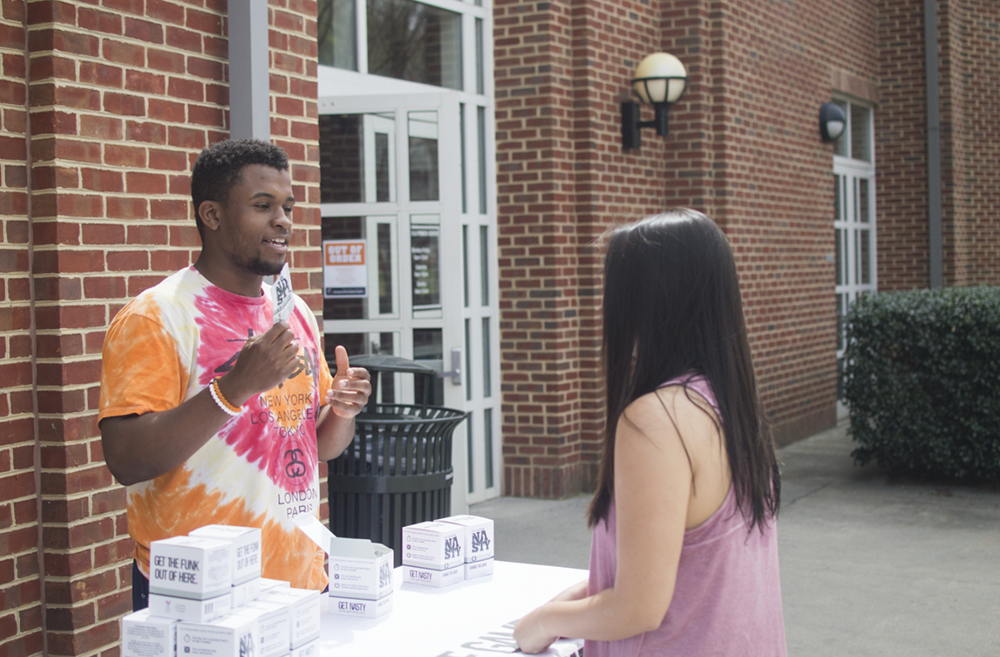
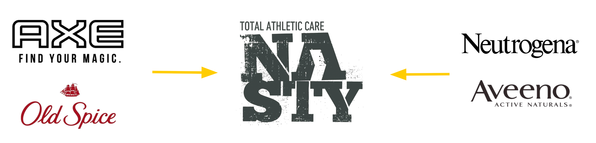
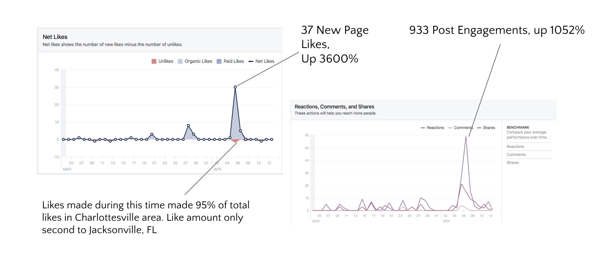
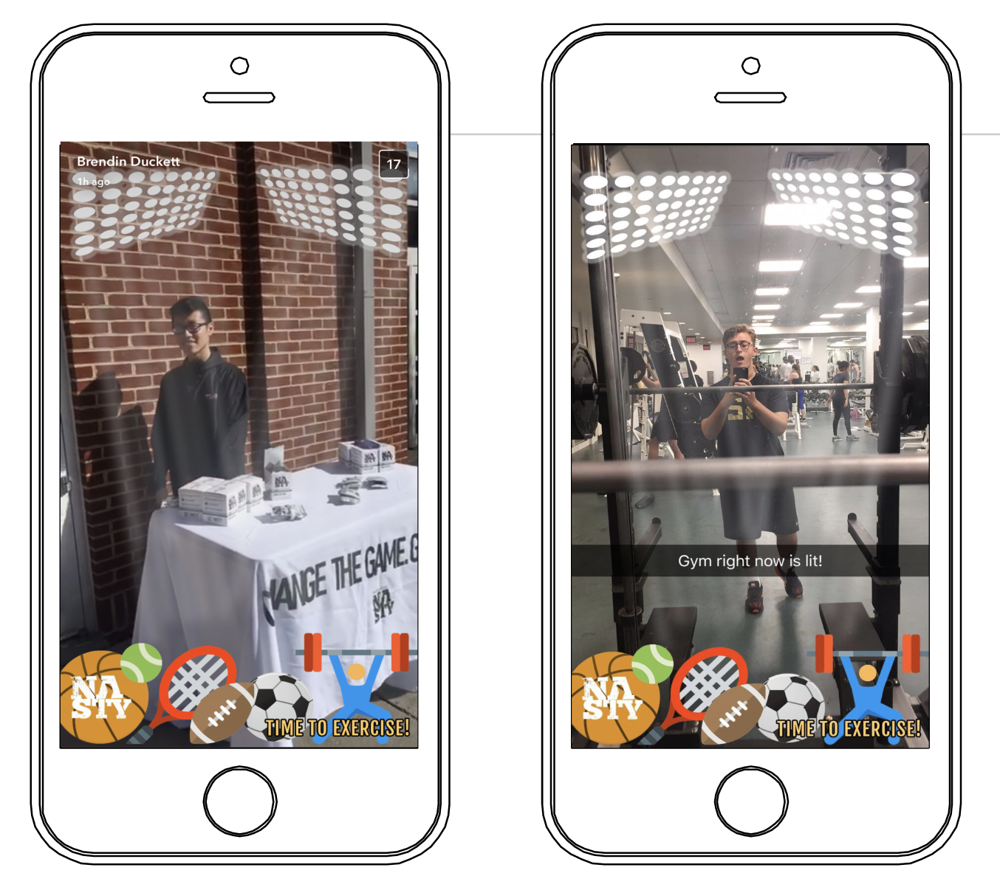
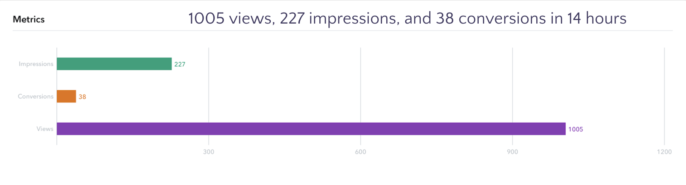

---

> "Garrett, Brendin, and Patrick's marketing strategy had a great breadth of execution, including multiple initiatives across both grassroots and digital plans. They generated positive results and strong takeaways, providing Nasty Athletic Care with a comprehensive and actionable strategy."
>
> _-Scott Greenhouse, CEO of Nasty Athletic Care_

# **The Client**

## ​​​​​​Nasty Athletic Care sells body wash and cleansing towels catered towards athletes.

It's sold in-stores at Whole Foods and online at Amazon where it was labeled a #1 new release and amazon's choice in its category. The company needed marketing help to expand its customer base both geographically and demographically, specifically to a college market.

# **The Process**

Implemented digital and grassroots marketing campaign titled the "Every Day Athlete". Had a two-day test run of our implementation strategies.

# The Outcome

Our team placed first in the competition through each of the three stages out of 12 teams and 6 finalist groups. We helped to recalibrate the company's target audience, and provided market research with actionable insights. With our digital campaign, we increased user engagement 10x over a two-week period, with digital reach increasing 14x. Generated 34x more followers than average for our implementation period.

# **Surveying**

For this project, our team's approach was research oriented. Rather than come up with a marketing strategy on our own, we surveyed or interviewed **215 students from UVA's general body and 34 Division 1 UVA athletes** to better grasp the needs of the target market.

We found that on average Virginia college students went to the gym >1 times per week (42%), and bought their own body wash at grocery stores or online, with an ideal price point of \$10. One of the main friction points we found for people not going to the gym is that they don't have the time to go home and shower afterwards, before their next class or meeting.

# User Testing

Setting-up a table outside the busiest gym at the university during peak hours, we marketed the product and gave away free samples with user interviews to gather public opinion. We exposed the product to over 100 new members of the target population, and generated critical feedback for how to move the product marketing strategy forward. As a side effect, we also brought in 50 new Facebook likes.

---

# Marketing Strategy

## Our research showed college gym-goers were more interested than D1 athletes in the product.

We wanted Nasty to find its own space in the body wash market. Being from all natural ingredients but also catered towards athletes, it fell right in the middle of the spectrum of body washes.
Thus, we decided to alter the target audience to cater towards what we labeled "The Everyday Athlete". We made the primary selling point of the product to be a "quick fix", for when you want to go to the gym but don't have time to shower afterwards, where the cleansing towels makes it easy to fit more stuff into your day.

---

---

<iframe src="https://www.facebook.com/plugins/video.php?href=https%3A%2F%2Fwww.facebook.com%2Fnastycare%2Fvideos%2F401831603529518%2F&show_text=0&width=560" width="560" height="315" style="border:none;overflow:hidden" scrolling="no" frameborder="0" allowTransparency="true" allowFullScreen="true"></iframe>

# Strategy Implementation

To test the strategy for validity, we created a digital brand campaign. We focused on social media exposure and marketing through Snapchat and Facebook as we found these channels the most effective at targeting our market.

We spent time in the community tabling, putting up posters, and interacting with students to gauge interest in the product. We took pictures from these events as our primary source of marketing materials for Facebook, which generated surges in traffic.

We also ran a custom Snapchat filter to incentivize athletes to show off their workout, and open up the target audience to a wider variety of people.

---

---

---

---

# **Key Takeaways**

1. Adding a human factor to social media posts tremendously increased user engagement and exposure.
2. Physical tabling generated the largest customer acquisition on campuses over other tested avenues, due to the users being able to interact with the product directly.
3. The cleansing towels generated more interest in the market over the body wash, as it solved a problem users hadn't found an alternative to.

It was a great opportunity in which we learned a lot about brand strategy and efficient implementation strategies. Having other avenues and more time for implementation would have created a more sustained impact in the brand awareness of the company.

