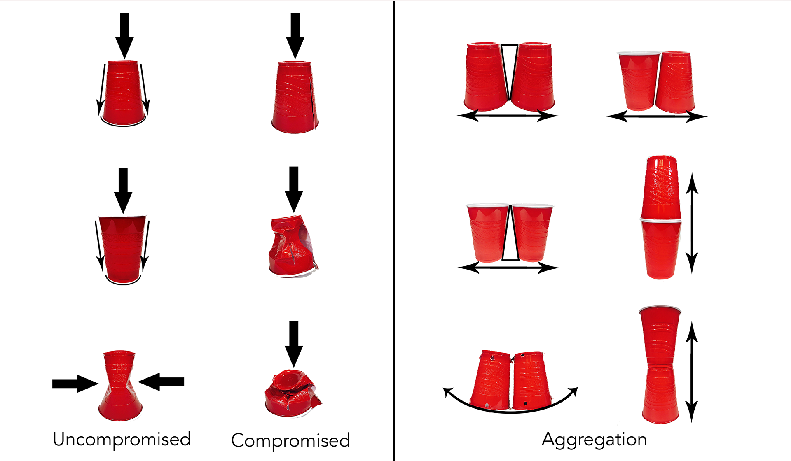
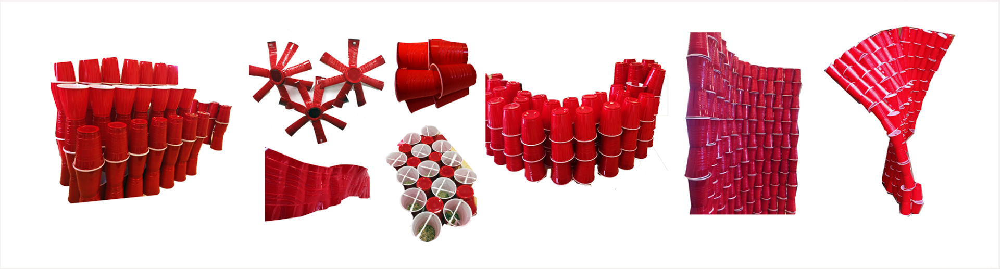
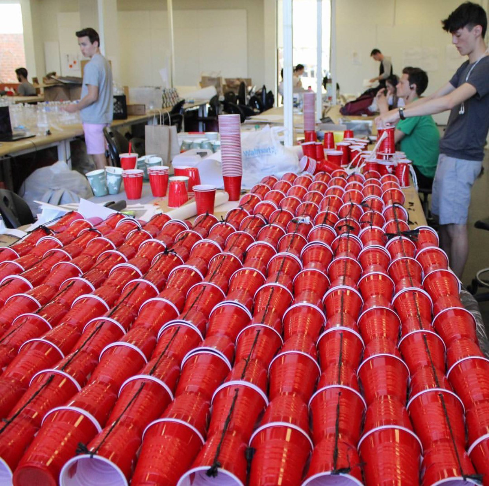
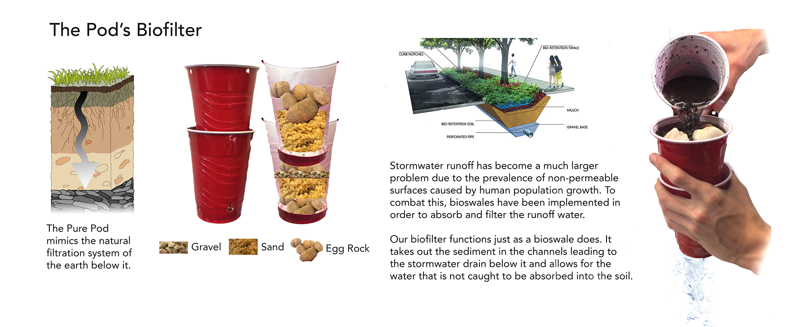

---

## Solo cups are recyclable in Charlottesville yet they're often thrown in the trash or cast to the ground.

Walking to class on Monday we'd often notice solo cups scattered across the roads, the grass, and even in front of the architecture school (as fraternities live close by). Solo cups are recyclable in Charlottesville yet they're often thrown in the trash or cast to the ground.

# The Challenge

Construct a "Pod" in which three people are able to live for twenty-four hours. The Pod must be mono material and made from reused and recyclable materials.

# The Process

With a constrained budget of \$75 plus product, our team of three collected over 4000 solo cups from surrounding fraternities and explored the ways in which they could become structure. We used reused plastic garbage bags as a fastener for the cups.

# The Outcome

In addition to making a habitable structure out of solo cups and garbage bags, our pod functioned as a water filtration system for stormwater runoff.

---

## Experimenting With Aggregation

The first step to creating the pod was seeing how the solo cup functioned as a structural object and how it began to change as it aggregated. There were numerous forms of stacking patterns that offered varying benefits.

---

---

## Building Large

For our first large-scale aggregation, we decided to stack the cups vertically as that's when they're structurally strongest. To make this model we cut off the bottoms of every other cup so that the bottoms could snap together. We then put holes through the top rim of the cups and used cut up solo cup strips to tie the tops together. We quickly realized that though this unit functioned great as a wall and even was able to twist and adjust its shape, it wouldn't be structurally sound as we created larger units.

---

---

## Building to Our Site

We chose our site on the hill because of the interest relationship it had with the stormwater drain beneath it. After a heavy rain, water would pool up at the top of the hill and gather sediment. As the rainwater went down the hill it would bring the sediment and other debris down the drain with it. This drain we found led to the Chesapeake, which had a large enough pollution problem already.

---

# Take Two and Three

Realizing we needed to take a different direction, we introduced plastic bags to our construction to add some rigidity.We did the same vertical stacking as before, but used vertical tension with the garbage bags and horizontally we weaved the solo cups together. From this, we were able to make a unit that could curve into the shape we needed.While this method was great in creating the archway we were going for, it wasn't able to keep its shape in larger aggregates. We tried linking them horizontally and making an archway but it also had similar issues.

---

---

## Creating a biofilter

We decided to make the stormwater drain the focus of our pod in addition to it being habitable. We made the base layer a foundation by placing a natural biofilter within the cups to filter the rainwater. Garbage bags would be strapped to the biofilter layer to help in keeping the structure upright. The removable roof would be made of woven solo cups and could be installed if weather was unfavorable. After living in it for 24 hours, we were able to easily dismantle the structure and completely recycle it.

---

<iframe src='https://www.ccv.adobe.com/v1/player/ccv/95kW2pPgSzY/embed?bgcolor=%23191919' width='560' height='400'>

# Final Take

We decided on stacking the cups horizontally as it created a natural curve. The garbage bags were tied from either end to help add rigidity. We implemented a floor to lie on so that during heavy rain it would pass right under you sleeping. We also broke the structure into three parts so we each would be able to sleep privately.

---

