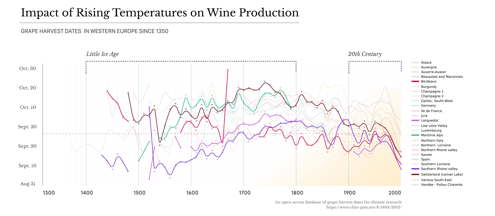
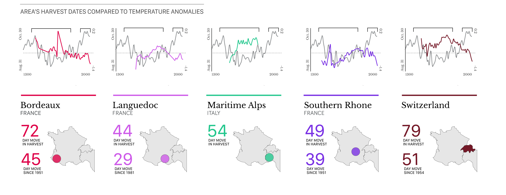
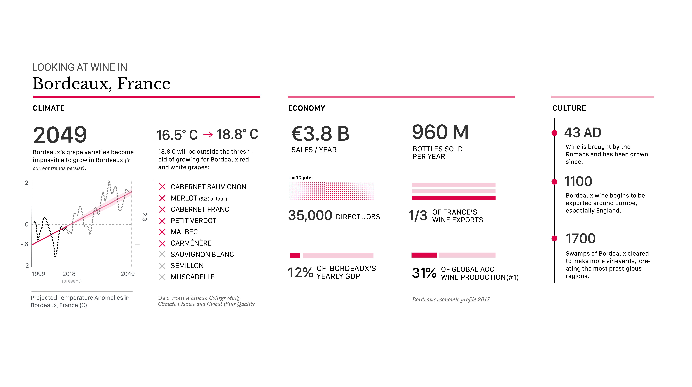

# Context

## The grape harvest is dependant on seasonal temperatures.

To understand how climate change may be affecting the wine industry, I looked at roughly 700 years of grape harvest data, back to 1350, for 30 different wine producing regions in western Europe. What is graphed in the above image is the first day of harvest for each year and region. If the harvest date is later in the year, it means that the grapes needed more time to mature, which indicates **lower** temperatures. The earlier the harvest date, the **higher** the temperature. One can see in all thirty of the regions show similar harvest patterns, with a dramatic change happening in the past century.

---

# Further analysis

## Looking at the 5 regions that have changed the most over 650 years.

While all 30 regions show significant changes, it would be too difficult to generate finer grain insights by looking at all of them. The 5 regions that changed the most are primarily in France, with one being Switzerland and the other being in Italy. This is an important note, as France makes a large percentage of the world's wine. One thing that is especially apparent is that the majority of the harvest date change has occurred over the last 50 years. Overlaying a climate model of the past 700 years, you can see the inverse relationship of harvest date and temperature difference.

#Takeaways

## Bordeaux may not have many of their wines by 2049.

Based on a climate prediction model the majority of Bordeaux grapes will be unable to be grown by 2049. A small temperature change by that date makes many of the grapes outside of their growing temperatures. This may severely impact their economy if not looked at.

