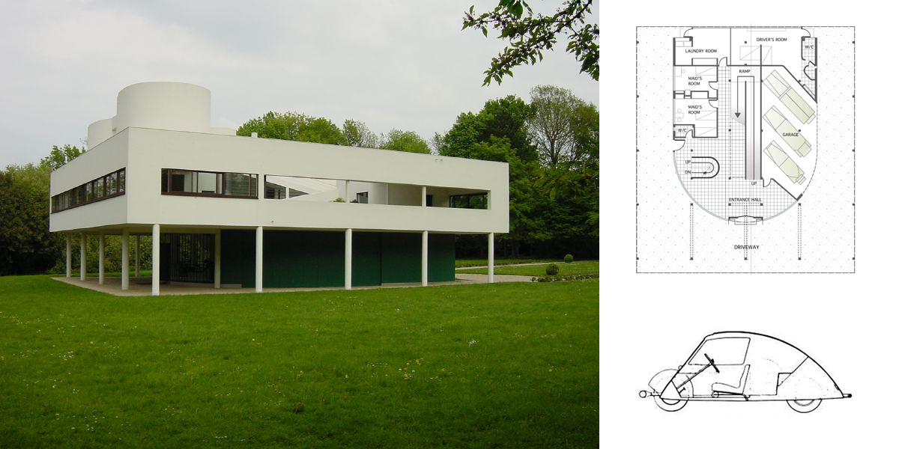
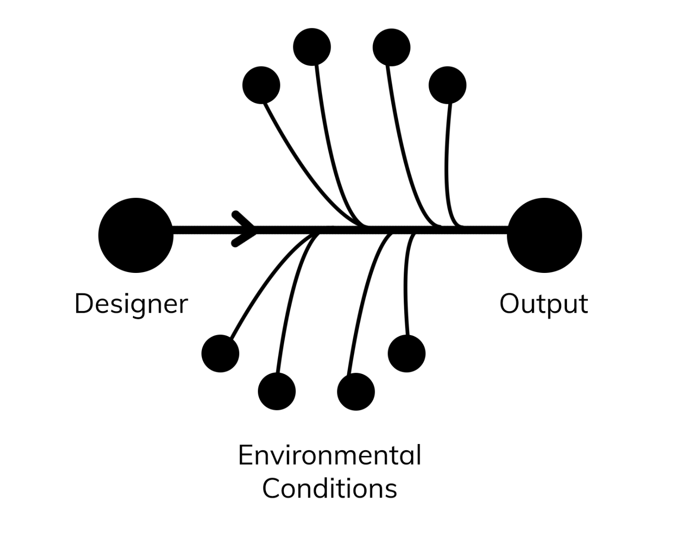
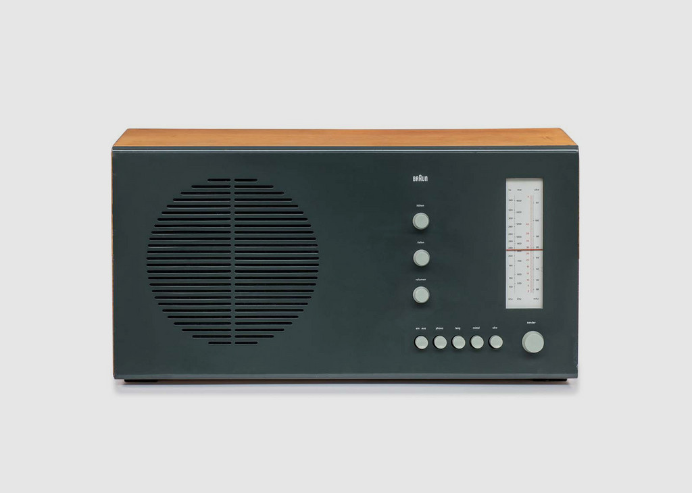
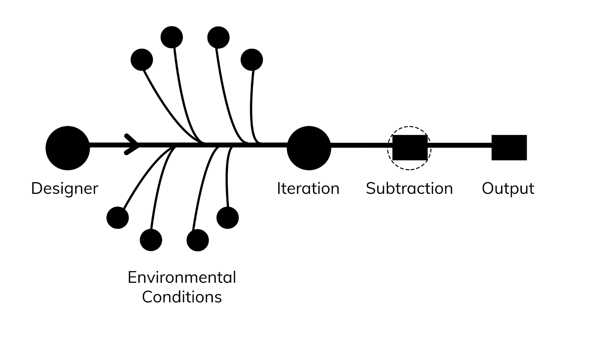
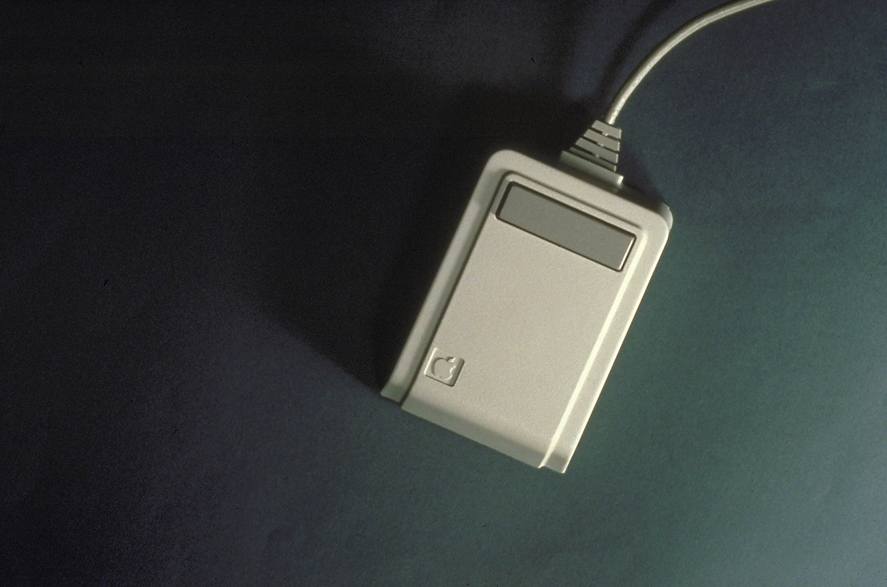
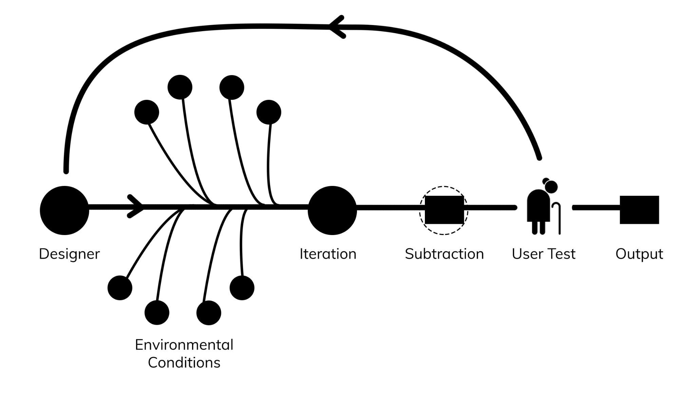

> "The combination of computing and communication, as we know it now and can expect it to evolve in the decades ahead, will vastly expand human creative capacity."

–Jerry Wiesner, MIT Media Lab

The role of the designer has changed more in the 21st century than any century before it. User experience design, user interface design, information architecture, graphic design, data visualization, motion graphics, software design: these design jobs are some of the most in-demand in the industry, yet most of them didn't exist thirty years ago. The computing industry has radically changed modern technology, and the profession of the designer alongside it. Designers somehow are able to fit to this new digital medium in a tremendous way. This successful transformation to new mediums is due to the fact that designers are _flexible; design is not_.

As a designer, my range in projects has jumped from front-end web/software development, data science, graphic design and architecture. While each discipline is in differing industries of work, I often use the same process of designing to form a solution. Whether I design a housing complex or a restaurant's website, I always start with understanding the stakeholder and begin an iterative process from that point. Design is a mindset. A consistent strategy to solving problems has allowed the types of work produced from designers to vary wildly throughout history and in the modern day. The ability of the designer to be flexible in adapting to the specific problem within the process, is what makes design impactful to any industry.

# Learning the design process

## Through the built environment

Laugier in the 1700's brought up the idea that the architect is the original designer. Since shelter is one of the basic requirements to living, this form of design has been alongside humans since the very beginning. Because of this, a lot of practice across design of modern day takes influence from this practice. Since buildings are both time and financially expensive, an iterative design approach has born out of architecture.

Just as designers can be innovative, they often have to be reactive. One of the most famous architects of the 20th century, Le Corbusier, saw that the rise of manufacturing and the growth of cities would cause a huge change in the practice and expectations of a designer. Corbusier focused heavily on the introduction of the automobile into society, and how that would have to change urban planning and the design of homes themselves. In his Villa Savoye building, he left the whole first floor open to the parking of a car, and focused heavily on having the house look best from the angles of the road that the car approaches the house from.

Architecture like the Villa Savoye shows how a designer must be reactive. Whether it be new technologies, topography, environmental systems, structure, or budget, the architect learns to create within a real-life context.

## Through Objects

The industrial designer Dieter Rams designed over 400 products for Braun, from interior designs to a radio. He created his own design manifesto where he founded the "10 Principles of Good Design". One of the most poignant of those principles is his last one (and the one that was most important to him), "Good design is as little design as possible". This idea is central to the work of industrial designers today, and one which isn't as easily learned from architecture. Looking at architects like Zaha Hadid and Frank Gehry, buildings are expressive and thus often complex. In industrial design, the product often has to be as simple as possible for it to be understood.

This brings in the necessary layer to the design process: subtraction. After an iteration has been created, one must test the product with users and see what isn't necessary.

## Through Computers

The introduction of the computer to businesses and the consumer changed the way in which the world operated. This growth in computing has developed at such an exponential rate over the 21st century, that humans have a difficult time catching up. The computer brought about an interesting design problem when it was first introduced: No ordinary person knew how to use it.

One of the most important factors to the growth of the computing industry was a design solution: graphical user interfaces. By having a desktop, a virtual and abstracted representation of the processes of a computer, an ordinary person could now understand a computer. The difficulty still? Navigating it.

Steve Jobs in the early days of Apple was having difficulty in figuring out how to get a user to navigate one of their earlier personal computers, "Lisa". He asked David Kelley, founder of the design firm IDEO, for help. They returned back with the mouse, which easily and cheaply tracked hand movement and clicks that could then be used to parallel the cursor movement and clicks on a screen.

The mouse was so successful because it could be intuitively understood. Physical hand movement was translated to digital movement. David Kelley in his 2002 TED talk explains:

> Product design has become much less about the hardware and more about the user experience.

David Kelley, Human-centered Design

His company, IDEO, has brought to light the importance of empathy in design, especially in computers. When designing digital products to the average consumer, you would want your grandmother to be able to understand how to use it and enjoy it, as she didn't grow up in a world of computers. Because of this, design should always be inspired by the user.

## Designers are flexible; design is not.

The true power of a modern day designer is generated from learning a design process between all these design disciplines. Rules for design decisions are never beneficial, such as "always have an open floor plan" or "never use more than three colors on a website". They might be good starting points, but will always place restrictions at a certain level. Rather, focus on a universal design process. A good architect must learn from industrial design and practice subtraction and maximize human understanding of built space. An industrial designer must learn from architecture with environmental limitations: In what type of culture will the product be used? How will the product change over time? And lastly human-computer interaction design teaches that just because we understand a system or product does not mean the user does. We must go back to the user as often as possible to make sure designs are on the right track.

From this understanding of a universal design process, an architect can become more than just a designer of buildings: he or she can become a designer of anything. And this is true with all specialized fields of the modern era. Dell released a 2017 report that 85% of the jobs needed in 2030 haven't currently been invented yet. This will be true for the design field as well. By having a design practice that can be applied to any field, we as designers become adaptable to any new form of design the future holds.

References:

Le Corbusier. Towards a New Architecture

Sophie Lovell. Dieter Rams: As Little Design as Possible

Laugier. Essays of Architecture.

Walter Isaacson. Steve Jobs.
