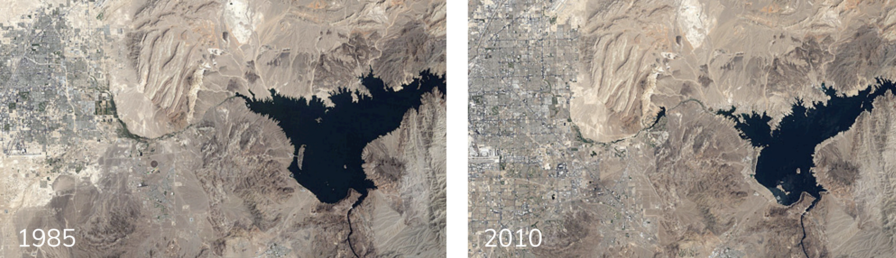
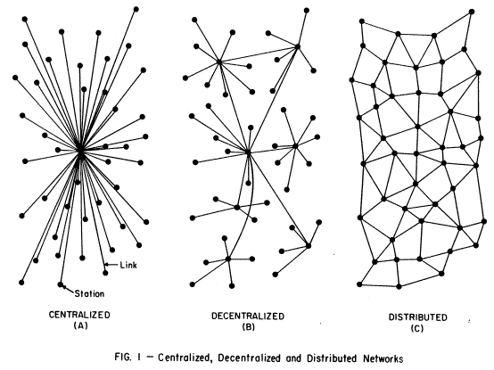
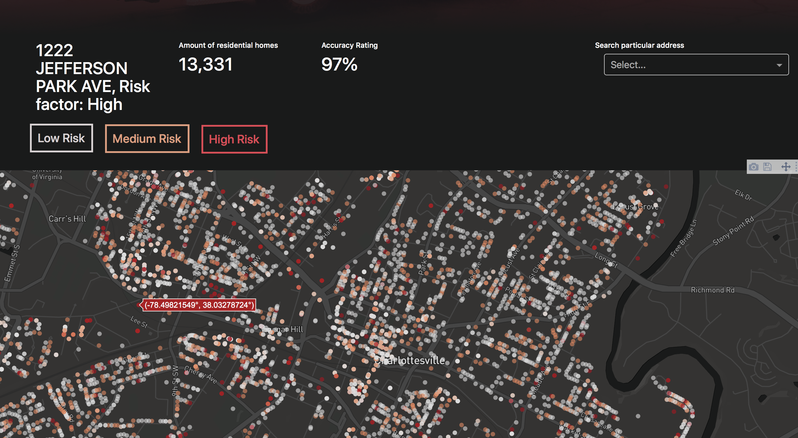
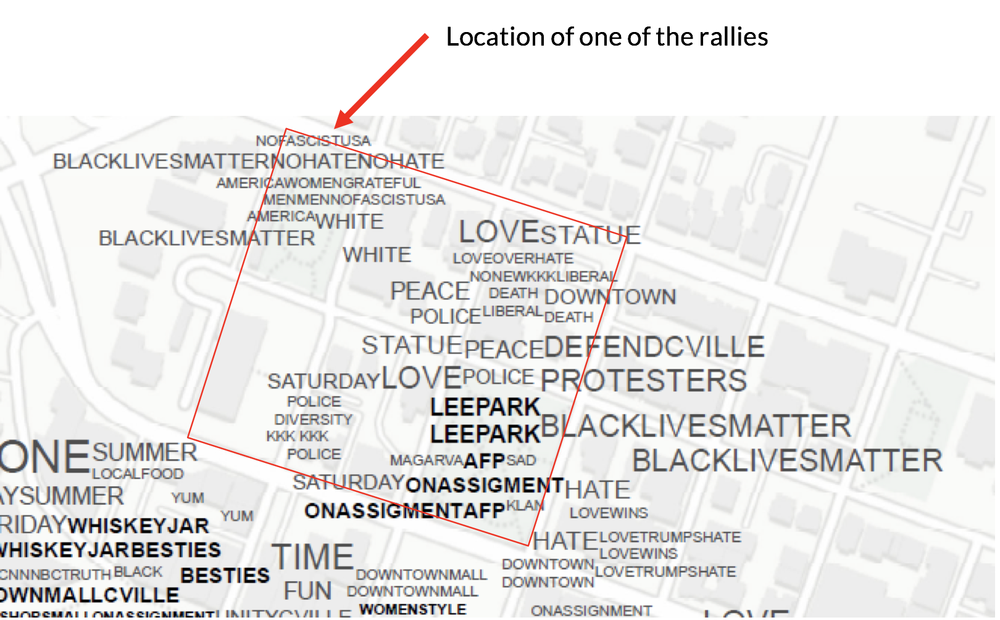

> Learning from the existing landscape is a way of being revolutionary
> for an architect. Not the obvious way, which is to tear down Paris and
> begin again, as Le Corbusier suggested in the 1920s, but another, more
> tolerant way; that is, to question how we look at things.

-Robert Venturi, _Learning From Las Vegas_

Crowds of pedestrians lining the sidewalk with faces turned down towards brightly lit iPhones. Uber drivers pulling up at every corner. Electric bicycles. Grocery delivery systems to your tiny square footage apartment several blocks north. Technology has radically changed how people interact and live in cities. With such a quick rate of technological change from the consumer-up, how do cities respond?

Whereas the way a person operates within a city has changed radically, the process of designing a city to respond to the person has changed at a much slower rate. Looking back on Robert Venturi's _Learning From Las Vegas_ has brought to light the constant redefinition of the city of Las Vegas, with it constantly being in a state of change to impress the modern decade. However from this constant growth and resource usage, the city has had unintended consequences, such as the Lake Mead next to the city shrinking dramatically.

This ecological change is a direct result of the misunderstanding of the city and its complexity. Las Vegas and other cities are all complex distributed networks, where a myriad of different activities and elements occur that create emergent properties which can often go unnoticed. It takes urban planners and designers to understand this complex system of a city to make sure the effects of this complexity are beneficial rather than detrimental.

## City as a Collection of Data Points

To start to understand the workings of a city, it's important to understand the ways in which a city is connected. Each city is a distributed network, where singular elements (such as a person, a business, or a car) all interact in constantly changing ways, with relationships self-organized and not governed by a singular entity such as in a centralized system (such as a corporate company or dictatorial government).

MVRDV in 1999 conceptualized the idea of a city as being a "Datatown", which can be used to better understand the idea of a city distributed network. Their suggestion is for architects and urban planners to scrap their conceptual and ideological mindset when looking at a city, and instead **look at the data**.

> Datatown is based only upon data. It is a city that wants to be described by information; a city that knows no given topography, no prescribed ideology, no representation, not context. Only huge, pure data.

-Metacity/Datatown MVRDV

By looking at a city such as Las Vegas or Seattle as an aggregate of data, the amount that can be learned is infinite. But with such large amounts of data for a city, a resulting question emerges: How can designers filter the good data from the bad? How do we know what data is important?

Michael Batty and Paul Longley begin to answer this question in their article, _The Fractal City_. Understanding themselves that a city is a complex network, they looked towards fractal geometry as a point of inspiration. A fractal originates alongside chaos theory, where a simple system or pattern can create unpredictable results. A fractal thus is a good metaphor for a city. What is important is to find the basic starting patterns, rules, or elements that make the fractal (or a city) what it is.

How can a designer find these basic elements that everything else relates to? The "rule of hand" heuristic states "the most important changes [of a system] can be understood by analyzing a few, typically no more than five, key variables". For example, if an urban planner is looking at real estate development, the median price of a two-bedroom apartment or amount of homes sold per month could be the driving variables for development. Luckily, computers can often help find these key variables and the "important data" better than a human could with the use of machine learning algorithms.

To give a more concrete example of understanding what data matters, I will briefly explain a project of mine that has helped to shed light on the possibilities of cities with the intersection of data and design.

## Merging Data with Design for Cities

A recent volunteer project I worked on was for the City of Charlottesville Fire Department, helping give insight on which buildings are at a high risk of fire. City fire departments across the country have difficulty in knowing what order to perform fire inspections for houses and businesses. With thousands upon thousands of buildings, knowing where to inspect first is almost impossible. And when they don't inspect the right buildings, fires occur.

I helped to create a machine learning model that took in 40 different characteristics of each building in Charlottesville, and the model was able to find which characteristics mattered the most and which buildings were at the highest risk of fire.

See the web application: [http://charlottesville-fire-help.herokuapp.com](http://charlottesville-fire-help.herokuapp.com/)

This project looks at the causes of fires in the housing network, which is a complex system, and by using data is able to achieve 97% accuracy ratings. The fire department now uses it to reduce the amount of fires in Charlottesville.

If design processes like this were extrapolated to different parts of a city, such as transit, or sustainability, cities could improve and change dramatically in just a few short years. Data in the hands of a designer can cause massive impact.

Understanding that a city is a complex system that often goes beyond a level of human understanding, it's important to realize the necessity of implementing data for the design of current and future cities. By realizing MVRDV's concept of a "Datatown", city design can be pushed to the modern age and become better tailored to the most basic building block of the networked city: the person. Data in the coming generation will be one of the primary tools in the urban planner and architect's toolkit, and cities will be better for it.

-**A Parting Thought**

One counterpoint that may be brought up is that data can't understand the more abstract parts of a city, such as culture. But this is untrue. With the rise of social media, the aggregates of data there can be used to understand what people are talking about and where. One of my prior projects looked at the culture change that happened in Charlottesville after the August 11th Unite the Right rally by looking at what people were saying on Instagram after these events took place.

Any problem or topic can be looked at through a data lens, if the person's creative enough.

References:

1. Charles Jencks, Karl Kropf. Theories and Manifestoes of Contemporary Architecture. Second Edition
2. Robert Venturi, Denise Scott Brown, and Steven Izenour. Learning from Las Vegas. Cambridge, MA: MIT Press, 1972.
